# R2 OS Attacks (Race Condition, Dirty COW, Shellshock)
# Dirty COW Attack

## Tujuan
Tujuan dari praktikum ini adalah untuk memahami kerentanan Dirty COW (CVE-2016-5195), mempelajari bagaimana race condition pada mekanisme Copy-On-Write (COW) di kernel Linux dapat dimanfaatkan untuk memodifikasi file yang seharusnya hanya dapat dibaca, serta memahami dampak kerentanan tersebut terhadap keamanan sistem melalui privilege escalation hingga memperoleh hak akses root.

## Environment
- OS:
  - SEED Ubuntu 12.04 (Kernel 3.5.0-37-generic)
  - Ubuntu 20.04 (Kernel 5.4.0-54-generic)
- Tools:
  - gcc
  - pthread
  - mmap
  - madvise
  - gdb
  - nano
  - cat

## Task 1 – Modify a Dummy Read-Only File
### Langkah
1. Membuat file target yang berisi "111111222222333333" dengan perintah berikut
```bash
sudo touch /zzz
sudo chmod 644 /zzz
sudo nano /zzz
cat /zzz
ls -l /zzz
```
2. Mencoba menulis ke file target sebagai user biasa dengan perintah berikut
```bash
echo 99999 > /zzz
```
3. Mendownload file program cow_attack.c berisi kode Dirty COW yang disediakan pada modul praktikum dan mengcompile program Dirty COW dengan perintah berikut
```bash
gcc cow_attack.c -lpthread
```
4. Menjalankan program Dirty COW dengan perintah berikut
```bash
./a.out
```
5. Menghentikan program setelah beberapa detik menggunakan Ctrl+C
6. Memeriksa isi file target untuk melihat hasil eksploitasi
```bash
cat /zzz
```
### Dokumentasi Output
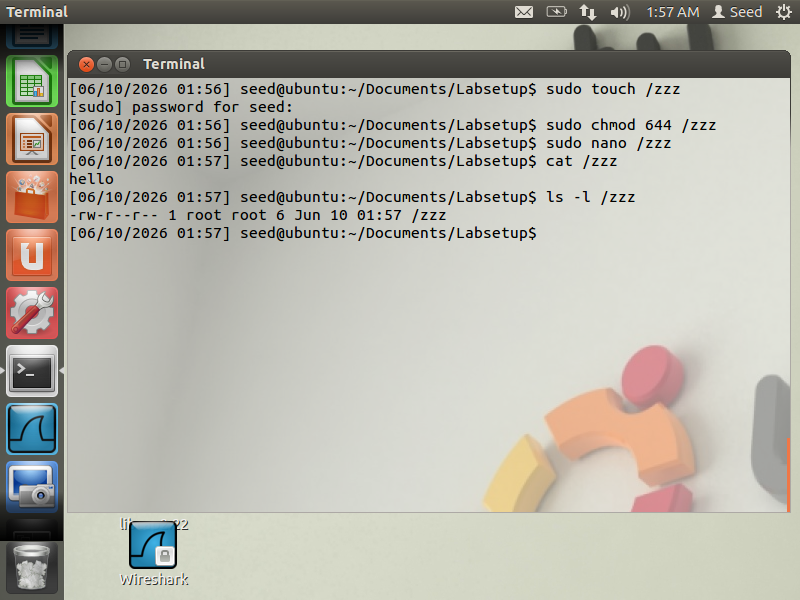  
*Gambar 1. Langkah 1 Task 1*  
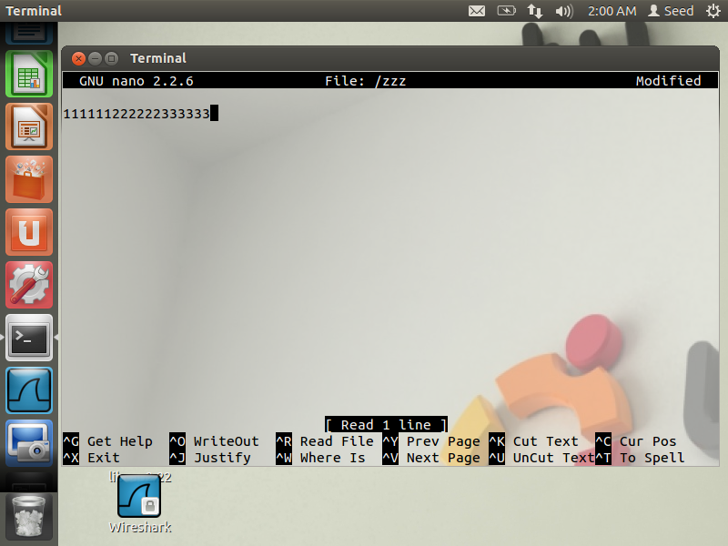  
*Gambar 2. Langkah 2 Task 1*  
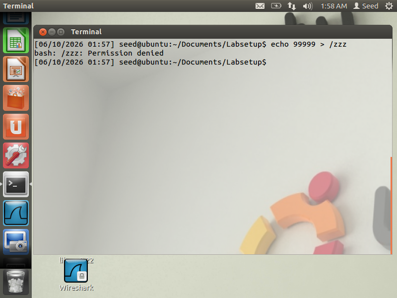  
*Gambar 3. Langkah 3 Task 1*  
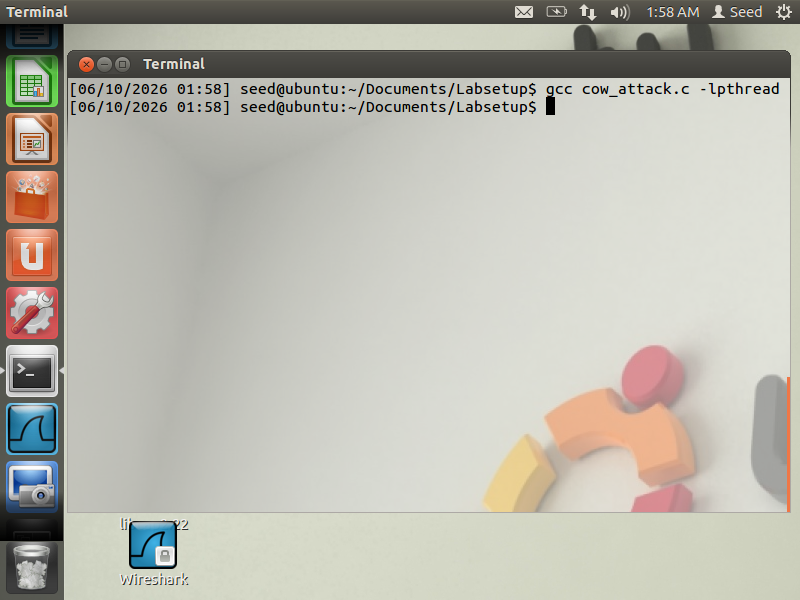  
*Gambar 4. Langkah 4 Task 1*  
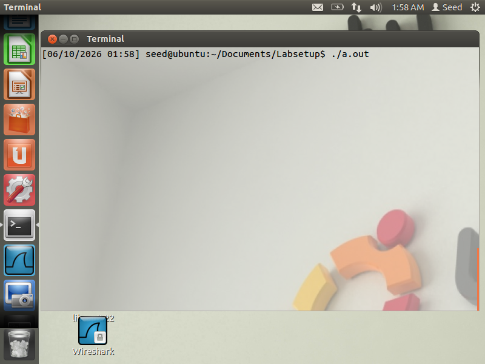  
*Gambar 5. Langkah 5 Task 1*  
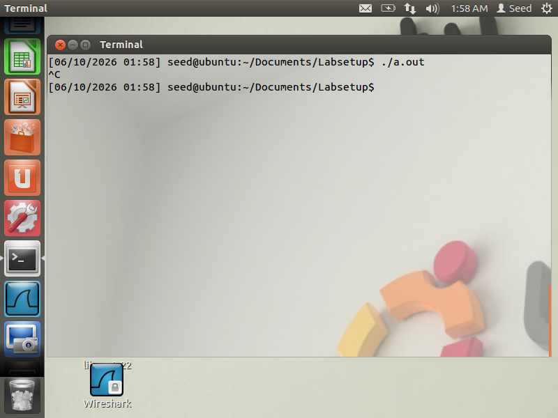  
*Gambar 6. Langkah 6 Task 1*  
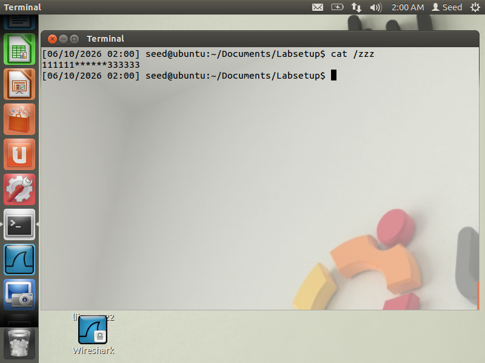  
*Gambar 7. Langkah 7 Task 1*  
### Analisis
Pada task ini dilakukan pengujian kerentanan Dirty COW dengan target file /zzz yang hanya memiliki izin baca bagi user biasa. Sebelum eksploitasi dijalankan, user tidak dapat menulis langsung ke file tersebut, yang ditunjukkan oleh munculnya pesan Permission denied saat mencoba melakukan operasi penulisan.

Eksploitasi Dirty COW memanfaatkan race condition pada mekanisme Copy-On-Write (COW) di kernel Linux. Program menjalankan dua thread secara bersamaan, yaitu writeThread() yang terus menerus menulis ke area memori hasil memory mapping, dan madviseThread() yang secara terus menerus memanggil fungsi madvise() untuk membuang salinan private page. Ketika kedua operasi tersebut terjadi pada waktu yang tepat, kernel dapat melakukan penulisan ke file asli meskipun file tersebut hanya memiliki hak baca.

Pada pengujian awal menggunakan Ubuntu 20.04 dengan kernel 5.4.0-54, eksploitasi tidak berhasil karena kerentanan Dirty COW (CVE-2016-5195) telah diperbaiki pada kernel tersebut. Program dapat dijalankan tanpa error, namun isi file target tidak mengalami perubahan sehingga race condition tidak dapat dimanfaatkan.

Pengujian kemudian dilakukan menggunakan SEED Ubuntu 12.04 dengan kernel 3.5.0-37, yang masih berada pada rentang kernel rentan terhadap Dirty COW. Pada lingkungan ini eksploitasi dapat dijalankan sesuai tujuan praktikum karena mekanisme Copy-On-Write yang rentan masih terdapat pada kernel. Hasil ini menunjukkan bahwa keberhasilan eksploitasi Dirty COW sangat bergantung pada versi kernel yang digunakan.

---
## Task 2 – Modify Password File to Gain Root Privilege
### Langkah
1. Membuat user baru dengan perintah berikut
```bash
sudo adduser charlie
```
2. Melihat informasi user yang baru dibuat pada file passwd
```bash
cat /etc/passwd | grep charlie
```
3. Membuat backup file passwd sebelum melakukan pengujian
```bash
sudo cp /etc/passwd /etc/passwd.bak
```
4. Memodifikasi program cow_attack.c untuk mengganti UID user charlie dari 1001 menjadi 0000

bagian ini:
```bash
int f=open("/zzz", O_RDONLY);
char *position = strstr(map, "222222");
char *content = "******";
```
diubah menjadi:
```bash
int f=open("/etc/passwd", O_RDONLY);
char *position = strstr(map, "charlie:x:1001");
char *content = "charlie:x:0000";
```
5. Compile ulang program Dirty COW dengan perintah berikut
```bash
gcc cow_attack.c -lpthread
```
6. Menjalankan program Dirty COW dengan perintah berikut
```bash
./a.out
```
7. Memeriksa hasil perubahan pada file passwd
```bash
cat /etc/passwd | grep charlie
```
8. Berpindah ke user charlie dan memverifikasi privilege yang diperoleh
```bash
su charlie
id
```
### Dokumentasi Output
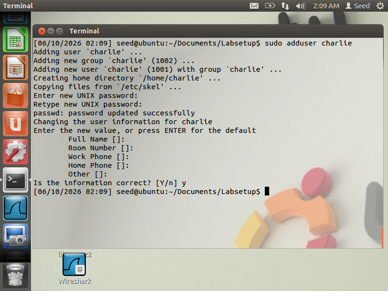  
*Gambar 1. Langkah 1 Task 2*  
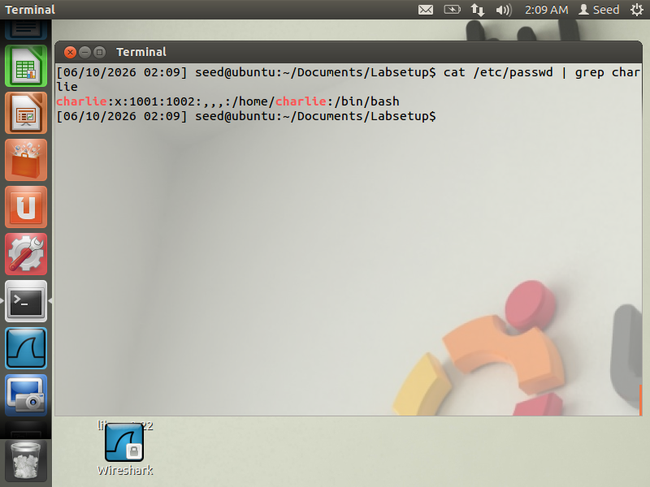  
*Gambar 2. Langkah 2 Task 2*  
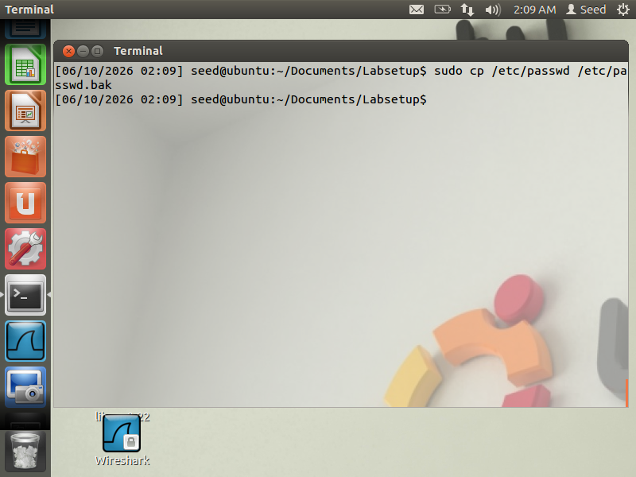  
*Gambar 3. Langkah 3 Task 2*  
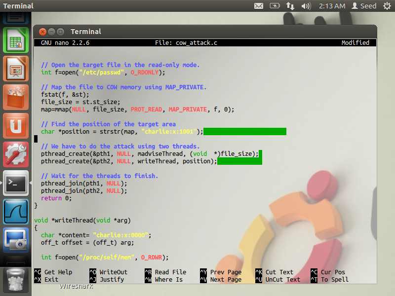  
*Gambar 4. Langkah 4 Task 2*  
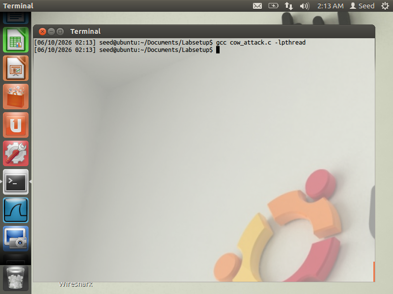  
*Gambar 5. Langkah 5 Task 2*  
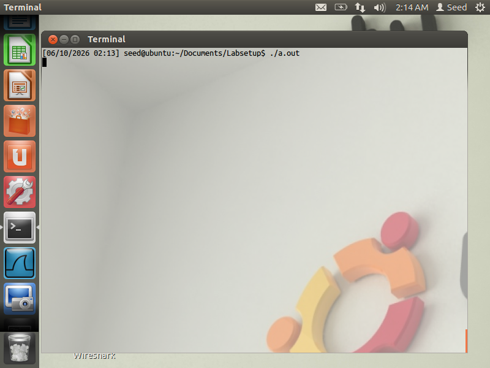  
*Gambar 6. Langkah 6 Task 2*  
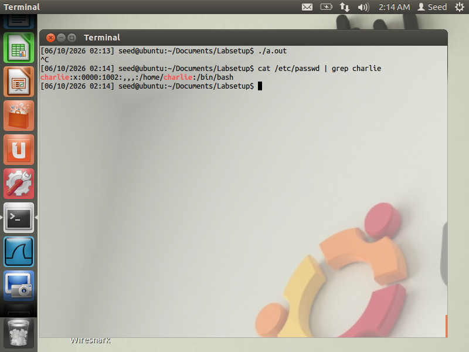  
*Gambar 7. Langkah 7 Task 2*  
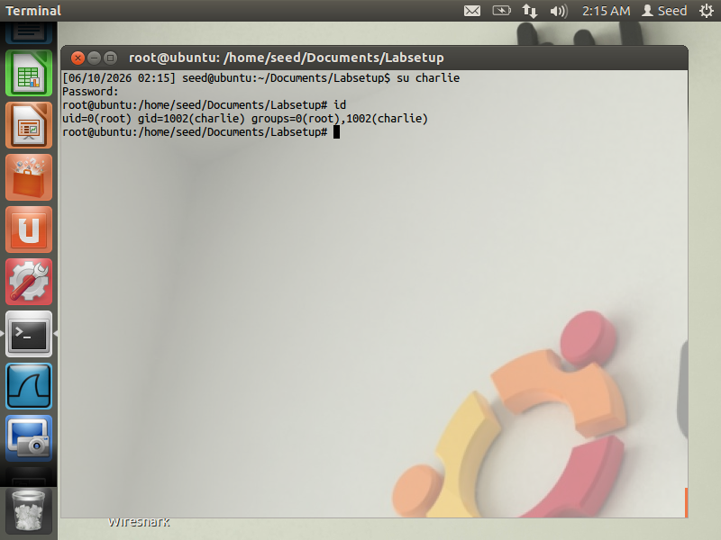  
*Gambar 8. Langkah 8 Task 2*  

### Analisis
Pada task ini target eksploitasi diubah dari file dummy menjadi file sistem /etc/passwd. Tujuan pengujian adalah mengubah UID milik user charlie dari 1001 menjadi 0000. Pada sistem Linux, UID merupakan identitas utama yang digunakan untuk mekanisme kontrol akses. User yang memiliki UID 0 akan diperlakukan sebagai root terlepas dari nama akunnya.

Program cow_attack.c dimodifikasi agar tidak lagi mencari pola pada file /zzz, tetapi mencari record milik user charlie pada file /etc/passwd. Dengan memanfaatkan race condition yang sama seperti pada Task 1, eksploitasi berusaha menulis perubahan langsung ke file sistem yang seharusnya tidak dapat dimodifikasi oleh user biasa.

Ketika pengujian dilakukan pada Ubuntu 20.04 dengan kernel 5.4.0-54, eksploitasi tidak berhasil karena kerentanan Dirty COW telah ditutup melalui patch keamanan kernel. Akibatnya, file /etc/passwd tidak mengalami perubahan dan user charlie tetap memiliki UID normal sehingga privilege escalation tidak terjadi.

Sebaliknya, pada SEED Ubuntu 12.04 dengan kernel 3.5.0-37, eksploitasi dapat bekerja karena kernel masih mengandung kerentanan Dirty COW. Dengan berhasil mengubah UID user charlie menjadi 0, sistem akan menganggap akun tersebut sebagai root. Setelah berpindah ke akun charlie, user memperoleh hak akses root dan dapat menjalankan perintah administratif yang sebelumnya tidak diizinkan.
## Mitigasi
* Perbarui kernel Linux ke versi yang telah memperbaiki kerentanan Dirty COW (CVE-2016-5195).
* Terapkan patch keamanan sistem operasi secara berkala untuk menutup kerentanan yang telah diketahui.
* Gunakan distribusi Linux yang masih mendapatkan dukungan keamanan dari pengembang.
* Batasi akses pengguna biasa terhadap sistem yang menjalankan kernel lama atau belum diperbarui.
* Terapkan prinsip Least Privilege dengan memberikan hak akses minimum yang diperlukan kepada setiap pengguna.
* Gunakan mekanisme keamanan tambahan seperti SELinux atau AppArmor untuk membatasi dampak eksploitasi apabila terjadi kompromi sistem.
* Lakukan monitoring dan audit terhadap perubahan pada file sistem penting seperti /etc/passwd, /etc/shadow, dan file konfigurasi lainnya.
* Gunakan Intrusion Detection System (IDS) atau mekanisme logging untuk mendeteksi aktivitas privilege escalation yang mencurigakan.
* Lakukan pembaruan dan pemeliharaan sistem secara rutin untuk memastikan seluruh komponen keamanan berada pada versi terbaru.
* Hindari penggunaan sistem operasi yang sudah tidak didukung karena umumnya tidak lagi menerima patch keamanan terhadap kerentanan baru maupun lama.

## Kesimpulan
Pada praktikum ini telah dipelajari bagaimana kerentanan Dirty COW (CVE-2016-5195) memanfaatkan race condition pada mekanisme Copy-On-Write (COW) di kernel Linux untuk memperoleh akses yang tidak semestinya terhadap file yang seharusnya hanya dapat dibaca oleh pengguna biasa. Eksploitasi dilakukan menggunakan dua thread yang secara bersamaan melakukan operasi penulisan dan pemanggilan fungsi madvise(), sehingga memungkinkan terjadinya kondisi balapan (race condition) pada kernel.

Pada Task 1, kerentanan digunakan untuk mencoba memodifikasi file read-only /zzz. Pada Task 2, teknik yang sama diterapkan untuk memodifikasi file /etc/passwd dengan tujuan mengubah UID user biasa menjadi UID 0 sehingga memperoleh hak akses root. Hasil pengujian menunjukkan bahwa keberhasilan eksploitasi sangat bergantung pada versi kernel yang digunakan.

Pengujian pada Ubuntu 20.04 dengan kernel 5.4.0-54 tidak berhasil karena kerentanan Dirty COW telah diperbaiki melalui patch keamanan kernel. Sebaliknya, pengujian pada SEED Ubuntu 12.04 dengan kernel 3.5.0-37 dapat dilakukan karena kernel tersebut masih rentan terhadap CVE-2016-5195. Hal ini menunjukkan pentingnya pembaruan kernel dan penerapan patch keamanan untuk mencegah eksploitasi yang dapat menyebabkan privilege escalation dan kompromi sistem secara menyeluruh.